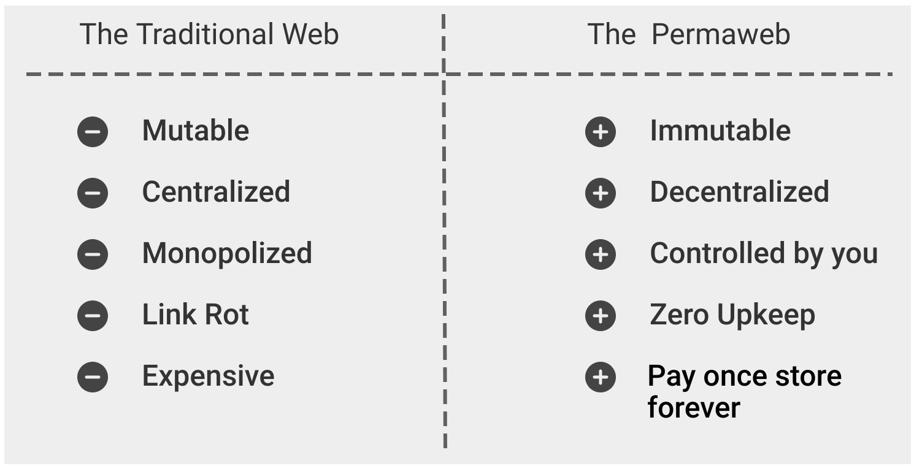

## What the Heck is a Permaweb?

Arweave isn't just about permanent storage. From here on out, let's look at the second half of their tagline: the promise of a decentralized web.

The Permaweb, as one would expect, is a "permanent web", an internet comprised of apps and sites that will "exist forever on Arweave". Essentially, websites would be built with Arweave as the underlying framework, being "severless" as the files that make up a site would simply be hosted on Arweave. Permanently.

Refer to handy diagram from the Arweave team for the pros and cons:

# A Heavily Opinionated Take

## Does Everything Need to Exist Forever?

Part of my gripe with the idea behind the Permaweb as it's been presented is the idea that immutability is always a good thing. There's a relatively harsh and direct philosophy that is being proposed by the Arweave team in the docs:

_"App developers have to make sure every new version of the app actually adds value, otherwise, why would you switch off the old one."_

Not every feature a developer adds can be introduced with the 20/20 foresight of it being a value addition, and immutability simply makes it harder for developers to meaningfully iterate and scale applications as any updates would require basically complete overhauls and redeployment.

An argument to be made for the permanence of versions is if a crappy update is pushed out and users don't like it. Then, they can continue to use an older version of the website without any further interference from the devs as an immutable, permanent copy of it exists. This is a natural extension of another quote from the docs:

_"Sites and apps are permanent, you never have to worry about them going away (even if the team supporting them moves on)"_

Again, this is not inherently a good thing! Even if an older version may have features that you like that were taken away, without an active dev team, it may not receive appropriate updates for more pertinent issues like privacy, security, etc. 

From a developer's standpoint, this does not sound like my app being wholly controlled by me!
## Anticensorship and Archival

The use of Arweave as an anti-censorship tool by archiving instances of websites in their permanent decentralized storage solution is a perfectly fair and valid point, akin to the usage of IPFS for similar purposes.

However, then there's the other question: do we need to archive everything? Do we need everything to remain uncensored?

There is a reason why moderation exists on social media sites, and it's not to impose woke opinions on the site's audience by silencing certain users. If I use Arweave to deploy a Twitter-like application, a dapp with [a step-by-step tutorial](https://arwiki.arweave.dev/#/en/creating-a-dapp) on their wiki, what if a bunch of people spam gore and porn and it now becomes immutably embed into the site with no means of scrubbing? What if a vulnerability is found in your frontend JS implementation allowing for an XSS that leaves your users at risk? Good luck rolling it back or pushing out an update! (Definitely do not try this on their public, deployed version of the aforementioned dapp [here](https://public-square.arweave.dev/#/). No way. Nuh-uh.)

On the note of archival, although you can make reasonable arguments against it, my belief is that if some information is crucial and important enough to warrant archival or immediate replication, _it would happen, with or without Arweave around_. We've got the [Internet Archive](https://web.archive.org/) for this very reason. The key benefit of using Arweave here is that if the Internet Archive gets sued or goes down, they're screwed, whereas archives uploaded to Arweave would remain on Arweave as long as the decentralized network doesn't implode. However, this sort of archival and the whole Permaweb are arguably independent concepts: I don't need my devs deploying on the Permaweb if I want to archive important information, and if a dev produces something meaningful enough to the population to warrant archival, _it would simply be archived_.
## Dynamic Websites

Static websites are something that can easily be deployed on Arweave. Sites that do not require much further interaction beyond consuming the content that's there, like wikis and blogs. These are the ideal sort of sites to be deployed on serverless solutions anyways.

Dynamic websites, if to be built entirely natively with Arweave, would be like all them other dapps, comprised of operations orchestrated and executed with smart contracts (which we will discuss in detail later) and having data written to the weave. 

Data immutability isn't some hot new selling point (that is meant to be the nature of all blockchains anyways), nor are smart contracts. What sets apart these dapps built on Arweave from any other dapp which interacts with, say, EVM contracts, is that they are being hosted on Arweave itself as well, being a "serverless" web application and thus a truer "decentralized webapp" (bar requiring centralized gateways still, of course). 

A handy list of webapps built on top of Arweave exists on https://arweaveapps.com/, free for you to explore.

## Moving On

I've said my piece about my thoughts concerning the Permaweb as a _concept_, but we're also here to analyse and judge the execution. Arweave has grown beyond just permanent data storage, with the initial introduction of [SmartWeave contracts](https://warp.cc/) and [ar.io](https://ar.io), and now... AO