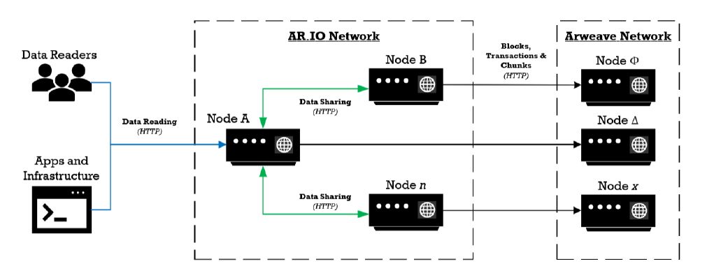

Although ar.io has shifted to AO, I believe there's still value in understanding how exactly ar.io, gateways and SmartWeave operated in order to evaluate the improvements that the AO migration should bring about. Besides, many of these concepts were simply ported over to an AO compatible implementation, so we have to cover them anyways.

The specs are messy, distributed across different whitepapers, docs and the such, but when you get down to the brass tacks, there's far less going on at a high level than you'd anticipate.
# Gateways

As is the case with many blockchain projects, it's unreasonable to expect every user that wishes to interact with the chain to run their own node for that purpose. Gateways, in this vein, are similar to RPC nodes: providing an accessible means for interfacing with a chain by behaving as a proxy.

Arweave gateways are distinct from nodes in that nodes lack any incentivization to serve data, whereas gateways are built for the purpose of data retrieval from the weave with a separate incentive token, $IO (not to be confused with io.net, of course).

Broadly, their functionality includes:
- Proxying chunks and L1 TX headers to nodes
- Construction of bundles
- Retrieval of TX headers and chunks from the weave
- Pricing rates
- Wallet information
- Parsing and execution of data retrieval queries
- Enabling Arweave Name System (ArNS) routing (more on ArNS later) 

We will primarily be referring to the [ar.io whitepaper](https://ar.io/white-paper) for this review.
## High Level Overview

Gateways act as the intermediate between end users and nodes in a direct, literal sense; Queries performed such as the fetching or searching of data on-chain will be facilitated by these nodes and queries are not directly made to the Arweave nodes that are storing the replicas which make up the weave.

Gateway operators stake $IO tokens as their collateral, with this staking being non-inflationary, with it being a barrier to entry for participation and thus receival of rewards rather than a means to generate yield (except for the case of delegated stakers, where they receive a cut of rewards without running a gateway). This stake **does not get slashed** if a gateway is behaving maliciously! The only penalty is simply not receiving rewards and having your tokens locked up for nothing. 

Gateway operators also register on the Gateway Address Registry (GAR) such that they are discoverable to each other and to end-users. This enables data sharing between gateways such that cached data need not be re-retrieved from on-chain if another gateway operator holds a copy. This can be performed in a quid-pro-quo fashion, where you only share data with other operators that are actively sharing accurate data (think of maintenance of a good seed ratio) so you end up avoiding malicious gateway operators.
## Modularity

Gateways are said to be modular in the sense that operators are able to choose the functionalities they wish to serve e.g. enable data retrieval but not indexing of bundles.

This produces different "classes" that your nodes can fall under:
- Partially synced, non-mining, chain-only nodes
	- Accept TX headers, manage mempools, read latest chain info
	- Useful for wallets, accessing latest data
- Fully synced, non-mining, chain-only nodes
	- Able to read all L1 chain info
- Fully synced, non-mining, chain + chunks
	- By being able to store chunk data, you can now fetch replicas from the L1 and bundles (which count as L2)
- Fully synced, mining nodes
	- Unlikely to be used as a gateway at the same time as resources would be dedicated to mining
## Content Moderation?

Apparently, gateway operators are allowed to decide what content they want to store or serve and has the right to blacklist content or addresses as they see fit. This is not in contradiction to their anti-censorship stance as any blacklists do not behave as a blanket ban that all nodes have to adhere to. This obviously brings up the concerns of the storage and subsequent hosting/serving of potentially illegal material e.g. CSAM, extremist media, snuff/gore, which is a common criticism against these sort of censorship free systems (and one that I agree with, as a criticism).
## Arweave Name System (ArNS)

What good is a decentralized web if you have no DNS equivalent? Similar to how nobody is out there memorising IP addresses for their favourite websites, nobody is gonna remember long hashes to access Permaweb sites.

The ArNS facilitates this by allowing users to register domains with $IO, in which an Arweave Name Token (ANT) is created which grants you ownership and modification writes to the domain entry, after which your lease can be extended with $IO.

Gateways thus double as DNS servers to help resolve ArNS domains to the appropriate Arweave TX which corresponds to the file which should be served through the link.

There's not much to discuss concerning the implementation itself as it's just, well, a domain name service. What's more interesting is how the contract is implemented and it's underlying tech: SmartWeave (which we shall discuss soon enough).
## Observers

One notices that we have yet to discuss a Proof of X for our gateways. How are we supposed to trust the data that gateways output?

Gateways are thus able to operate as "observers", in which they evaluate their peers' performance to accurately resolve ArNS names, in which a random subset of ArNS names are chosen and a report is generated indicating each peer gateway's performance in the resolution task.

Reports then serve as votes (so falsified reports will be counted in, but hopefully if the system works as intended, would not be able to sway the quantity of legitimate votes that come in) which are then used to determine the reward distribution. Reports are also published on-chain and thus can be audited, so nodes that consistently produce falsified reports can be blacklisted.

In essence, this is a sort of consensus algorithm? And more notably, it only applies to the ArNS task, nowhere in the whitepaper do I find reference to the verification of fetched data from the weave. Yikes.

All in all, it is interesting that Arweave has opted for such a system where there isn't collateral slashing (so it's not PoS, I guess) and instead almost wholly relies on the nature of its rewards system to dissuade malicious behaviour. The minimum collateral to participate is the main barrier when it comes to sybilling, I suppose.
# SmartWeave

Question: how do you execute smart contracts operations on a network that is geared towards data storage?

Answer: lazy execution, where the burden of contract execution is shifted away from network nodes to smart contract users.

Let's unpack this.
## Lazy Execution

Traditional smart contract systems have nodes executing all TXs, evaluating whether the operations are a-okay and rejecting invalid operations. In the case of SmartWeave, the Arweave nodes storing replicas do none of the actual execution work — instead, users interacting with the SmartWeave contract **evaluates all prior TXs up to the current one**, then the user evaluates their own call to the contract, submitting the resultant state to the Arweave network.

SmartWeave contracts thus are stateful by nature, as you rely on the previous state of the contract to recursively evaluate up to the current point of execution. They're also written in Javascript (how convenient!) as they are meant to be executed by smart contract users, and by that they mean running it in your browser's Javascript engine.

Purported benefits:
- Smart contracts can now be arbitrarily complex, or basically as complex as a Javascript engine can handle. 
- Smart contracts are now gasless, as you need not pay gas for nodes to perform computations for you.
- "Storage is decoupled from computation", or in other words, nodes meant for storage get to stick with storage

However, there are glaring issues with this sort of smart contract implementation...

## This Does Not Sound Scalable

And you would be right. Although the article published on SmartWeave's launch crowns it as "one of, if not the, most scalable smart contract \[system] available" ([link](https://arweave.medium.com/introducing-smartweave-building-smart-contracts-with-arweave-1fc85cb3b632)), there is an obvious flaw in play here: what if the transaction history gets really, REALLY long?

As SmartWeave contracts are reliant on client-side execution of it's entire TX history to facilitate verifiable execution, contracts with thousands of interactions could take minutes to hours to even _fetch_.

This is now where [Warp](https://warp.cc/) comes in, which is itself a smart contract SDK that implements the SmartWeave protocol but with many important QoL features like cross contract execution, speedups on contract execution and protection against corrupted transactions. 

How? Creating another gateway system dedicated to fetching contract interaction TXs so that you aren't bottlenecked by ar.io gateway's GraphQL query restrictions.

This still doesn't solve the issue of computations taking hella long. Also, if everything is client side evaluated and then published on-chain, what if an illegal state is published? 

Warp also has a solution for this: **offload the computation to _their_ DRE nodes**. So then, you get rid of client side execution! Wait, what?

I think we might have reinvented the wheel.
# Moving On To AO

So, SmartWeave just wasn't as scalable as the Arweave team thought it would be, [they've realised](https://ar.io/articles/ar-io-network-moves-to-a-super-computer). However, the devs have already built all their gateway infra (the Gateway Address Registry) and the ArNS on top of SmartWeave and these are still needed for the continued development of the Permaweb, so they can't be abandoned! We need some sort of computation framework that enables the creation of smart contracts that can interface with the storage layer that is Arweave.

This is the point where AO, the _Hyper. Parallel. Computer._ is meant to swoop in and save the day. 
