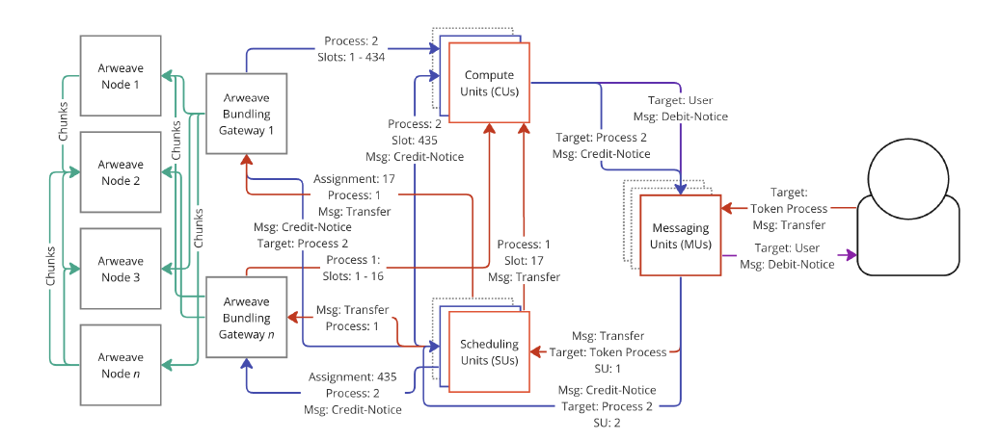
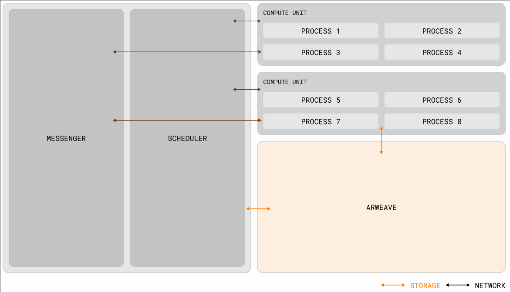
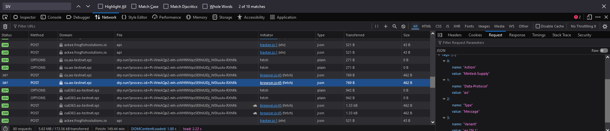

# The Decentralized, Open-Access Supercomputer

Supercomputer is a really bold term to use.

As is with many networks of its kind, one must ask the question: why would I use your network over something like ETH or SOL? What so special about it? What makes it _better_?

The AO website has this goofy console log output (yes, I'm being snarky):

So let's do just that: jump down the rabbit hole and see how much meat there actually is behind the hyper-mega-parallel-supercomputer.

# The Actor Model

Looking at things from a high level, AO claims to be an actor oriented machine which employs the actor model to accomplish distributed computation, so let's lay out what the actor model is (such that we can make apt comparisons and references to terminology later on).

Actors are your computation units, which receive messages, sends messages to other actors, manages it's own private state, and can spawn new actors. Messages here is used broadly and intentionally so (given that this is a theoretical framework), but in most cases messages would be requests to mutate or modify an actor's private state or query that private state.

Besides messages to communicate with one another (which is accomplished asynchronously with buffers aptly called mailboxes), actors otherwise operate in isolation from one another without any shared memory. These messages are read from the mailbox buffer sequentially, so if one actor requires a task to be completed $n$ times concurrently, it has to be sent to $n$ different actors.

With this sort of framework, concurrent execution is an intrinsic component of the actor model as actors do not have fixed dependencies on one another, with interaction between actors only being accomplished through message passing, with no strict restrictions on the order that messages come in.

Multiple actors, intuitively, would form an actor system.

This is a very abstract concept and those with any form of concurrent programming experience should find the ideas proposed here to be familiar.

# The AO Architecture

Let's list down what AO claims it would accomplish:
- A shared computer to execute multiple processes with cryptographic security
- Arbitrary number of parallel contracts, with processes not interfering with one another
- "Unbounded resource utilization"
	- "Nodes in AO do not need to perform any compute at all in order to reach consensus about program state transitions" — a very loaded claim that we'll address later
	- We also find reference to the Lazy Execution that we explored before, we'll see how relevant it is later
	- It appears that the AO VM is built atop WASM, so we may anticipate that the lazy execution performed is as previously proposed — client side browser based execution
- Access to Arweave, allowing for "\[seamless loading] and \[execution of] data of any size directly into memory and write back to the network"
	- In other words, native integration of a storage solution. Got it.
- Allowing for scheduled smart contracts
- Modular architecture

## Components of AO

### AO Token
AO has it's own native token, $AO, which is used to implement economic security for processes e.g. via staking. At the same time, it just acts as a liquid unit of value for all operations on the network. 

AO makes the emphasis that there is no single global security mechanic and the use of the native token grants users and staked operators choices on what the agreed upon security mechanic would be for their process.
#### Minting
$AO is minted every 4 minutes to reach a total supply of 21 million tokens, with it accumulating to a monthly rate of 1.425% of the remaining supply, creating a log curve of minting.
#### Distribution
Given AO's intrinsic reliance on Arweave, all $AR holders are eligible to receive $AO. Bridging assets over to AO (e.g. stETH) will also reward $AO.
### Processes 
These are the units of computation, which is basically a representation of the resources needed and the relevant messages, private data storage to accomplish a task. Processes are thus the Actor in the actor model that we are following.

AO does not provide a universal format nor does it enforce a specific VM, so your processes will have to include parameters that describe:
- The max memory to be used
- The max number of operations the process may consume while evaluating a single message (?)
- Any additional extensions e.g. hardware-optimization, virtualized local file system
### Messages
Process interactions are represented by messages published on-chain via Arweave's [L2 bundling spec](https://github.com/ArweaveTeam/arweave-standards/blob/master/ans/ANS-104.md). Messages can be sent from users to processes or between processes, which is what we're anticipating given the actor model in play.

Upon receipt of a message, processes can choose to engage with, ignore or request re-transmission with different security parameters.
### Scheduler Units (SUs)
Responsible for the "single assignment of atomically incrementing slot numberings to the messages". So this just means... a sequencer for messages.

Essentially, every message received corresponding to a process will be assigned a unique incremental nonce such that messages can be ordered in relation to one another.

"Secure staking processes" would have the SU putting up its own stake of tokens, which would be subject to slashing if:
- It fails to assign a nonce to a message
- Maliciously drops messages
- Fails to write the message log to Arweave
- Assigns the same nonce to different messages
### Compute Units (CUs)
 As the name implies, the nodes responsible for calculating the state of processes.

Some quotes from the whitepaper:
- "While SUs are obligated to sequence the messages of processes they have accepted, **no CU is required to calculate the state of a process**, This \[creates a P2P market] for computation"
	- Put a pin on this statement!
- CUs will output a signed attestation of output when it actually calculates a process' state
	- Attestations published can be loaded by other nodes and could be subject to a _UDL fee_
		- The "Universal Data License" (UDL) is a spec to allow for royalties payouts when your data is used in another project. Okay...

Attestations can also be subject to the inclusion of "SIV" (this acronym is never unwrapped in the paper), in which a minimum number of attestors' signatures are required for a result to be validated.
### Messaging Units (MUs)
Nodes responsible for relaying messages, be it making sure messages reach SUs or coordination with CUs to calculate the output of interactions. 

Processes can also pay MUs to subscribe to a process and periodically push messages from the process to them. Alternatively, messages can be _casts_, where MUs send the messages to its SU but without waiting for a response.

If an MU is caught signing an invalid message, stakers within the given staking process can slash the MU's stake. If it's not the MU's fault and instead the CU's for messing up the attestation, then the MU can assert a claim against the CU's stake and receive a compensation from the CU.

Here's an image depicting the overall architecture that is deceptively complex:

The process flow is best explained through a look at the `aoconnect` library ([here](https://github.com/permaweb/ao/tree/main/connect)).

As anticipated, the flow is like this:
- Spawning of an ao Process requires it to be assigned to an SU
- Subsequent interactions with the Process require you to send messages to an MU
- Reading a result from a message evaluation will involve sending a message that gets passed from an MU to a CU, after which the evaluated result is passed back from the CU to MU back to you

This is represented in a much cleaner way with this other diagram AO provides:

### Holographic State Mechanism

Part of AO's selling point is the capacity for smart contracts to be executed with "unbounded resource utilization", and assuming we follow the lazy execution method as described for SmartWeave, this means that contracts are state oriented.

Here with AO, they now describe it as a "holographic state mechanism", where interaction logs are kept on Arweave, and this allows there to be "a 'hologram' of the state" for any users currently interacting with the contract and this produces... a guarantee that the same outputs are computed? (This is somewhat confusing. Would the outputs not differ based on the individual contract interactions? Do they just mean that the current state of the contract upon interaction is the same for everyone?). 

The CUs also provide their compute to resolve the holographic state (which I presume just means... performs the computation) and produces a _cryptographically signed_ attestation for the result (do note it isn't a _cryptographically provable_ attestation, just a signed attestation! I don't know yet if this is a failure in communication or if that's what's actually going on).

Holographic representation really is just a fancy way of saying that all contract interactions are logged...

## On-Chain Security

AO aims to operate with a "as and when is needed" security model, where users _purchase_ the specific level of security required for messages sent. As such, there are no block rewards or fee-bargaining mechanisms on AO, and instead relies on the emergence of a "dynamic marketplace for staking".

From my understanding, every message can request for for its recipients (the SUs, MUs, CUs) to have to stake some amount of $AO for a specified duration of time when it handles the message, with this serving as the insurance, and the amount you payout is variable but proportional to this stake.

Let's say that the participants expect an annual return rate of $R$ from their stake. So, if I have a message that requires $I$ amount of collateral over an exclusivity period of $E$ minutes, the price $P$ would then be
$$P = I \times \frac{R}{365*24*60} \times E$$
# Lazy Execution and Validation

## It's Actually Just WASM

In the case of AO, it is made fairly clear that their "smart contracts" are actually just WASM code that follows certain specifications made to run in a JS engine, and this is reflected in the implementation for the CUs ([relevant file here](https://github.com/permaweb/ao/blob/main/servers/cu/src/domain/worker/evaluate.js)). Similar to SmartWeave, this is what grants AO the sort of "unrestricted execution" it prides itself with as smart contracts aren't bound by the limits of a cryptographically sound and secure VM like EVM, they're _just regular WASM programs_.

What we can gleam is that for a process, if its the first time interacting with it, the CU would fetch the corresponding WASM from Arweave, compile and cache it, then use this instance to evaluate a received message based on the previous state of the process as published on-chain by another CU ([relevant code for fetching state](https://github.com/permaweb/ao/blob/main/servers/cu/src/domain/api/readState.js#L53)).

AO provides a [CLI](https://github.com/permaweb/ao/tree/main/dev-cli) that allows you compile Lua (a friendly language) into WASM (literally assembly), with examples of how to write contracts in Lua.

Take for instance the $AO Token spec, described [here](https://github.com/permaweb/ao/blob/main/lua-examples/ao-standard-token/token.lua). Essentially, a CU would load up an instance of the corresponding compiled WASM produced by this Lua file, then fetch the information about balances etc. that have already been published on-chain to populate the fields in memory. 

When you interact with this CU by sending a message to the process corresponding to the $AO Token to an MU, it will then update the balances in memory and then publish the result on-chain. 

**This also emphasizes the importance of the SUs**: as these CUs operate asynchronously, in order for them to be up-to-date on execution of a message and the previous written on-chain state is outdated, they have to iterate through all the messages that came between the last on-chain savestate and the current message to update their independent version of the program in memory.

Judging by the way message sending is described in the `aoconnect` library ([here](https://github.com/permaweb/ao/tree/main/connect#message)), we can certify that the "holographic state" thing earlier described does really mean you simply have your contract interaction logged, but if you want to get the result of the interaction, _it is necessary for you to request that a CU performs the evaluation itself_, else your interaction will never get processed until _someone else_ later makes a request for a result on the process, in which it will evaluate up the chain of logs and process yours along the way. 

It does feel like intermediate states should be resolved ASAP, however. Take for example basic transfer of value transactions: if I interact with the process by submitting multiple messages that reduce my balance and increases that of another wallet's, but continue to do so until my balance goes negative, the invalid state is only recognized once a CU gets round to evaluating all of my transactions, in which there would be a handful of invalid transactions that do not get rejected until far later than when the "execution" actually occurs. 

We see that on the AO gateway website it appears to circumvent the complexities of pending state updates and the latency of having a CU pull a copy of the Token program and fetching the latest state yadah yadah by just sticking with the same CU always:

## Validation and Verification

So this is where things get icky. **AO does not actually come with any sort of native validation mechanism**. As previously described, there is the whole staking situation going on (which I don't think has been implemented?), but there isn't actually any cryptographic proof system present.

This complicates things. Basically, AO gives us a sort of computation primitive, but then if you want to produce cryptographic proofs you're gonna have to implement it yourself. Furthermore, there isn't actually any existing mechanism in place to catch if a CU is just straight up faking outputs and emitting false results on-chain!
### Input Validation
Before all else, AO has basic input validation: your messages have to be able to actually interact with the WASM program corresponding to a process, so this is, like, the most basic line of defence to begin with.

AO, however, somehow treats this something worth even talking about, which is goofy.
### "Verifiable Reproducibility" and "Holographic State"
So what we have here is that we have no actual native means of verifying a CU's output. AO says this is okay, because we have the holographic state — if a CU is screwing with us, then it's alright as you can always reproduce what the legitimate state of the program should be by reiterating through the entire message log (the "holographic state") and passing it through a trusted CU, so there's reproducibility in play, but not necessarily verifiable either...

Yes, you can have a cron job that will periodically check on the correctness of the published states of a program, but then that relies on having another pool of trusted CUs that will accurately perform the task of checking for correctness. Yes, this can be additionally facilitated with some sort of staking and shuffling system  to prevent Sybilling (the whole SIV proposal in the whitepaper), but this is like placing a band-aid over things. 

You essentially create a verification system based on an external set of CUs replicating execution from previously known good states in order to identify whether a published state is legit or not, multiplying the computation cost of the program (and these verifiers aren't going to be doing the verification for free!). Then, how are you supposed to curb CUs that continue to publish bad states? Perhaps the verifiers can produce a blacklist of CUs? But then how can that be enforced?

Wait, what if we're talking about programs like LLMs (a selling point of AO)? In this case, we have a log of all the interactions with the LLM program and the corresponding outputs, but what if false outputs are written on-chain? There's no way to verify outputs except _replicating execution wholesale_, and even then, it would essentially require some consensus like algorithm to facilitate the cross-referencing and verification of outputs, and this would be extremely costly!

Sigh... With all these caveats in mind, we can come up with a sort of concluding remark:
# AO: Arweave Ordinals?

The AO whitepaper gives a very high level view of how the network architecture would look like with very little time spent on the actual technical details of how it would be accomplished.

We have some idea of their approach to certain things:

- AO is built with concurrent computing in mind by having independent compute units that work on distinct, separate processes, with interprocess communication being facilitated through messages.
- AO makes strong emphasis to its use of lazy evaluation and "holographic state", stating that the smart contracts will continually log its interactions and would not necessarily require a compute unit to resolve its state
- Users can still require that their interactions have a minimum number of attestations by compute units, but of course, at a fee
- When it comes to security, AO sees it as something "modular" rather than an absolute necessity that warrants enforcement
- Staking is the primary means of enforcing security, and this factors into the price of a message as participants must receive compensation for the duration in which their collateral is staked

Looking at the code base, we get a better sense of what's in play:

- AO smart contracts are really just arbitrary WASM programs, with the program state being continually updated by publishing of outputs to Arweave
- There is no native verifiable compute system in play, and the way of recognizing false or incorrect outputs that have been published is by literally redoing execution based on the log of interactions
- There can exist a system to look out for false outputs, though it would likely be computationally expensive, hard to enforce and silly complex.

Thinking much harder about the nature of programs on AO and the whole "holographic state" thing, we can actually boil down AO to _an ordinals-esque system_. Similar to the case of Bitcoin Ordinals, the L1 itself has no actual computation capacity and we solely rely on it as a storage medium for interactions. 

What AO in this case is, _is a decentralized ordinal resolution system_, similar to how BTC Ordinals require a third-party to index and calculate the state of ordinal tokens, except this third-party is all the compute nodes that make up AO and it offers greater capabilities than just inscribed tokens. Continuing with similarities, it is subject to the same pitfalls as ordinals: since anyone can inscribe whatever, you now need to build a whole new verification system on top of this primitive to ensure that the inscriptions are legit, which ends up being a complicated expensive process.
# Closing Up

So with all this in mind, let's address the claims posited at the very beginning.

Q: _Is AO a shared computer to execute multiple processes with cryptographic security?_
A: I don't see much cryptographic security given the lack of a native cryptographic proofs system nor do I see computation being natively shared (after all, a basic element of the actor model is this lack of sharing between actors!).

Q: _Does AO allow for an arbitrary number of parallel contracts, with processes not interfering with one another?_
A: Arbitrary number of parallel contracts subject to the number of compute nodes available to execute them. So yeah, sure.

Q: _Does AO allow for "unbounded resource utilization"?_
A: In its current state, it is very much bound by the capabilities and restrictions of WASM, and given that it is, ye'know, _Web_ Assembly rather than regular assembly, it's fairly restricted by what you can accomplish in its sandboxed execution environment. Yes, you will be able to run far more complex programs compared to, say, an EVM contract, but "unbounded" really is a stretch.

Q: _Does AO allow for arbitrary parallelization of programs?_
A: AO provides you with the primitives. Essentially, AO is just a decentralized compute network that you can send requests to, and it comes down to you to be able to effectively implement the distributed computation part, which is far from trivial.

From what I can tell, AO is closer to a compute marketplace like Akash than it is to some hyperparallel supercomputer. You've got some program that you delegate execution of to some compute provider and you interface with it through the whole network. The difference is just instead of having your interactions facilitated through TXs on a sovereign chain, you just have your interactions logged through inscriptions on the storage solution that is Arweave.

Similar to Arweave itself, AO just provides another primitive, this time round the basic blocks of a distributed computing network, but lacking in any sort of cryptographic validation in the computations that are performed. On top of that, you now also have the restriction of only being able to work with WASM programs. There is no unified supercomputer and it'd be almost deceptive to frame it as such. 

So this places it in a weird middle ground: AO doesn't have the cryptographic security that ETH or SOL would provide, nor does it trivially facilitate the execution of extremely complex programs that I would be able to have by just running LLMs as is on rented hardware via ionet (which would also allow me to achieve distributed computation with a cluster) or Akash. Instead, we have a bunch of nodes asynchronously running WASM programs that rely on the inscriptions of the program state onto a decentralized storage medium in order to keep chugging.

Personally, I'm sort of disappointed in this being the outcome. AO feels like it has lots of potential, but I'm seeing a lot of holes that would be far from trivial to patch up that make it far less exciting or inviting than on the initial onset.

