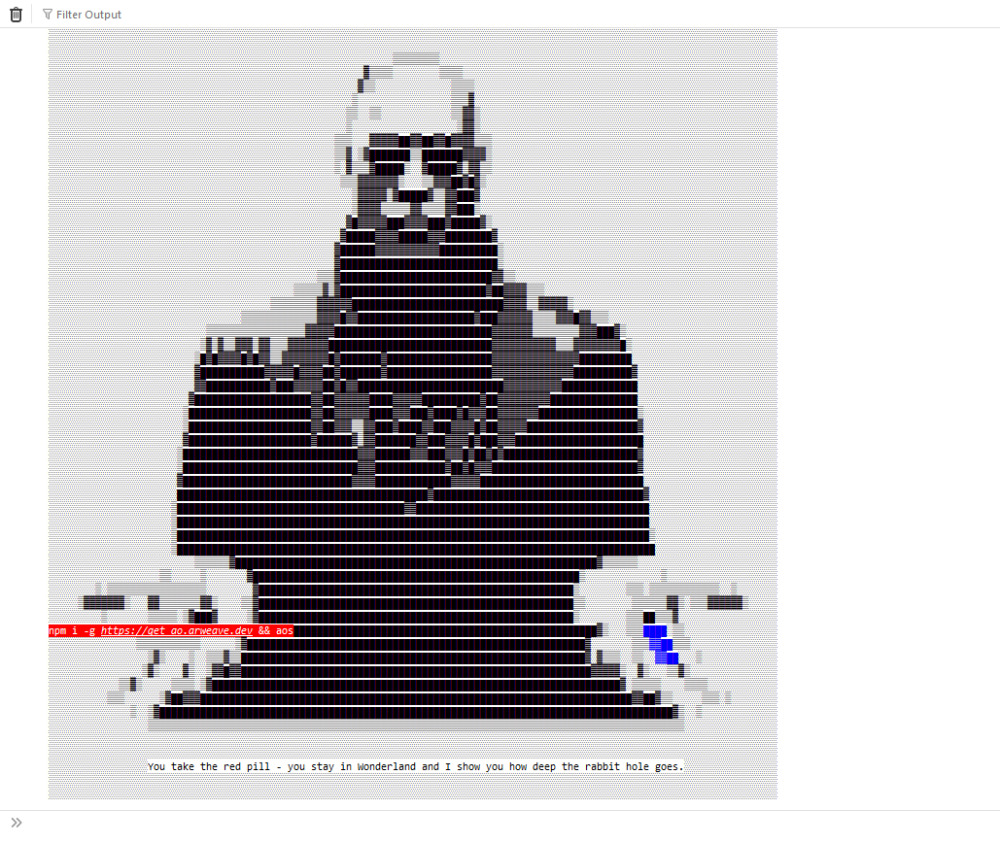

# The Decentralized, Open-Access Supercomputer

Supercomputer is a really bold term to use.

As is with many networks of its kind, one must ask the question: why would I use your network over something like ETH or SOL? What so special about it? What makes it _better_?

The AO website has this goofy console log output (yes, I'm being snarky):

So let's do just that: jump down the rabbit hole and see how much meat there actually is behind the hyper-mega-parallel-supercomputer.

# The Actor Model

Looking at things from a high level, AO claims to be an actor oriented machine which employs the actor model to accomplish distributed computation, so let's lay out what the actor model is (such that we can make apt comparisons and references to terminology later on).

Actors are your computation units, which receive messages, sends messages to other actors, manages it's own private state, and can spawn new actors. Messages here is used broadly and intentionally so (given that this is a theoretical framework), but in most cases messages would be requests to mutate or modify an actor's private state or query that private state.

Besides messages to communicate with one another (which is accomplished asynchronously with buffers aptly called mailboxes), actors otherwise operate in isolation from one another without any shared memory. These messages are read from the mailbox buffer sequentially, so if one actor requires a task to be completed $n$ times concurrently, it has to be sent to $n$ different actors.

With this sort of framework, concurrent execution is an intrinsic component of the actor model as actors do not have fixed dependencies on one another, with interaction between actors only being accomplished through message passing, with no strict restrictions on the order that messages come in.

Multiple actors, intuitively, would form an actor system.

This is a very abstract concept and those with any form of concurrent programming experience should find the ideas proposed here to be familiar.

# Purported Core Functionalities

