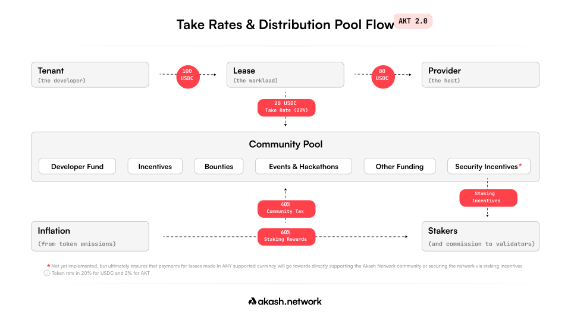
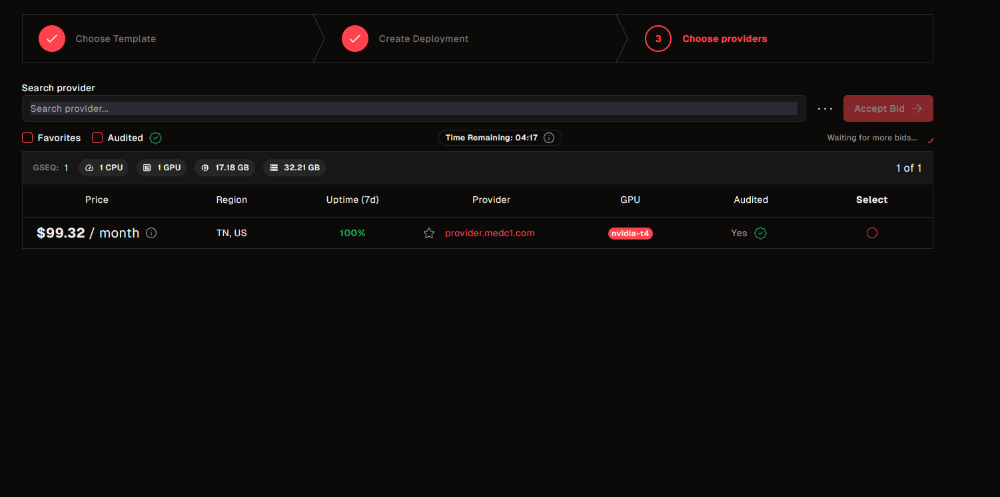
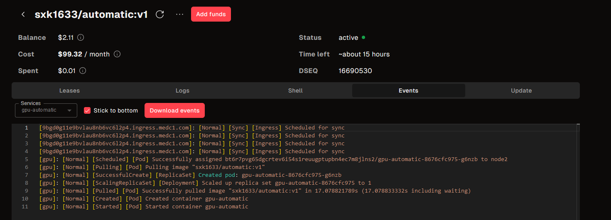
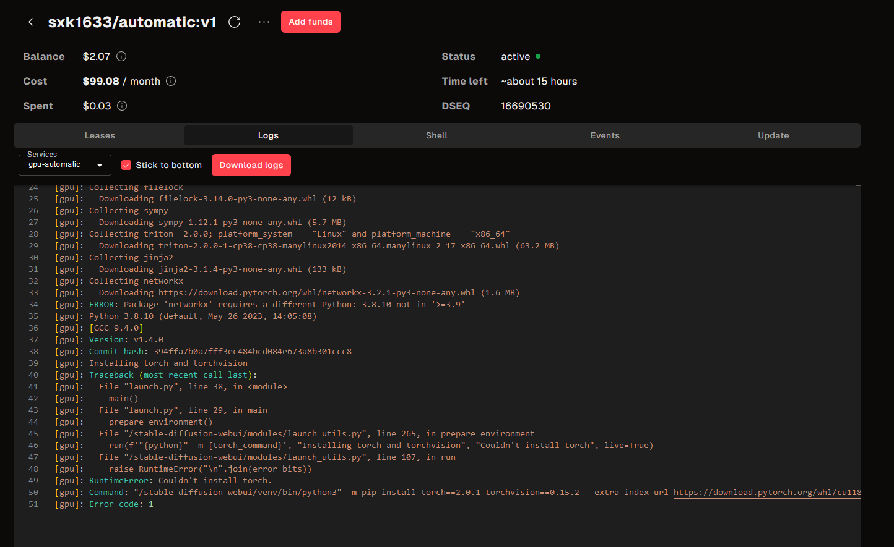
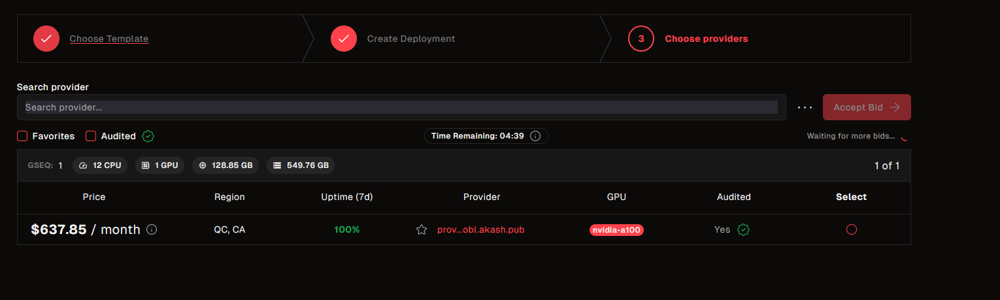

## Value Proposition

Akash aims to "revolutionize cloud computing" by offering affordable cloud resources, calling themselves the "Airbnb for Datacenters". Essentially, it is a decentralized compute marketplace.

<u>Issues with Centralized Providers (like AWS)</u>
- Price is determined by the provider
- High costs with long contracts
- "UX is what they build, and what you must use"
	- Not the biggest issue...
- Limited regions
- Vendor Lock In
- Lack of competitive pricing

## The $AKT Token



$AKT is the native token which is used as:
- The marketplace currency to pay for leased compute
	- As stated in the whitepaper, "tokens mitigate the foreign exchange risk that usually results from cross-border payments"
- Staking (the Akash network is PoS)
	- Passive income stream for stakers, "increases network security"
	- Instead of going through some approval process, providers must stake a meaningful amount of tokens to participate
- Governance
	- Proposal voting that can affect "critical parameters" such as inflation rate and take rates

### Reverse Bidding System

- Tenants place deployment orders which detail their needs, and a price is set
- Providers then place fulfilment orders that are matched up with deployment orders (bidding), where the lowest price wins
- When a match is made, a lease is created. Tenants submit a deposit, from which the lease is passively paid.

### Proof of Stake

- Implements the Ignite (Tendermint) algorithm for Byzantine fault-tolerant consensus
	- In other words, it's built on top of Cosmos
	- Round-robin block proposal 
- Sybil prevention by having limited $AKT to stake
- Number of validators will grow at a logarithmic rate (not exponential)
	- At genesis, there will only be 64 validators. In ten years time, there will be 277 validators.


## Network Participants

We have 4 main participants in the Akash Network:
- Validators, who handle the blockchain validation process
- Delegators, $AKT stakers
- Providers, the ones actually providing compute in the form of Kubernetes (K8) clusters.
	- Must maintain an $AKT stake as collateral
	- Thus, all providers are delegators and/or validators
- Tenants, who lease the compute by deploying Docker apps

### Nodes/Validators
- Since we're running a decentralized marketplace, we facilitate our payments via the blockchain
- Responsible for maintaining the blockchain itself
- Transaction validation and propagation
- Like any other RPC Node, they will also be the gateway to query information on the blockchain

### Providers
- The compute, the GPUs that can be used
- Bids on compute orders and subsequently manages the lease

## Verifiable Compute

Let's do some digging!

Akash promotes some [extremely competitive pricing](https://akash.network/about/pricing/custom/) and, honestly, [dirt cheap rates](https://akash.network/gpus/). How?

Looking at the [providers console](https://console.akash.network/providers), we notice an interesting filter: _Audited_. Lifting from their whitepaper, the original promise is that "\[rather] than requiring a centralized or federated approval process for new accounts, the Akash network allows anyone to join". Although this does not go against that claim, there is still an audit process in place. So how exactly is this audit conducted?

You open an Issue on their GitHub and request for an audit: https://github.com/akash-network/community/issues/575, after which tenants can then filter by audited attributes ([ref](https://akash.network/docs/providers/akash-audites-atributes/))

According to their docs, for the timebeing, there is a "comprehensive \[and] open-source framework" in development to "further decentralize the auditing of providers". The current interim process is quite literally having this one guy (Andrey Arapov, [GitHub](https://github.com/andy108369)) to check the details of your machine.

So at least on the front of verifiable compute, we've got nothing more than a "trust me bro".

## The Reverse Auction System

Lifting from the docs, the full deployment lifecycle looks like this:

1. Tenant creates a deployment, which is a `YAML` which details the resources they require (and supposedly, a price is set as well). A deposit also has to be submitted.
2. This deployment is submitted to the blockchain, creating an *order*
3. Providers listen for *orders*, and if they have the resources, they will *bid* on the *order*
4. The lowest cost + earliest submission is chosen as the winning *bid*, after which a *lease* is created
5. After the *lease* has been created, the tenant can submit a *manifest* which details the actual work to be executed
6. Through the *lease*, the provider receives the appropriate payout every block

Let's try and breakdown each step

### Deployment Creation

In the `YAML` file, you define "profiles", which is where you actually define the compute you are requesting. In other words, this is where you write down all the machines you are requesting and the specs you want. 

Take for example:

```yaml
profiles:
  compute:
    gpu-app:
      resources:
        cpu:
          units: 1
        memory:
          size: 38Gi
        gpu:
          units: 1
          attributes:
            vendor:
              nvidia:
		- model: rtx4090
        storage:
          - size: 100Gi

placement:
  westcoast:
      pricing:
        gpu-app:
          denom: uakt
          amount: 100000
```

Here I'm requesting one machine with 1 vCPU, 38Gb of RAM, 1 Nvidia RTX4090 GPU and 100Gb of storage. As for the pricing, I'm willing to pay a maximum of 100000 $uAKT per block. 

Pricing is denoted in $uUSDC and $uAKT, which is "micro-USD" and "micro-AKT", so you're working in 10e-6 divisions of either.

You can put some ridiculously cheap pricing, then it just comes down to whether there'd be a provider willing to match your rate.

### Bidding on Orders

Akash provides a [script](https://github.com/akash-network/helm-charts/blob/main/charts/akash-provider/scripts/price_script_generic.sh) that allows a provider to calculate what their bidding price should be based on how much they are willing to charge per month for each resource, where the output would be the target cost in $uAKT per block.

These are the following values you're able to set and the defaults that are provided (priced in USD/month):

```
PRICE_TARGET_CPU=1.60
PRICE_TARGET_MEMORY=0.80
PRICE_TARGET_HD_EPHEMERAL=0.02
PRICE_TARGET_HD_PERS_HDD=0.01
PRICE_TARGET_HD_PERS_SSD=0.03
PRICE_TARGET_HD_PERS_NVME=0.04
PRICE_TARGET_ENDPOINT=0.05
PRICE_TARGET_IP=5
PRICE_TARGET_GPU_MAPPINGS="a100=120,t4=80,*=130"
```

### Is This Profitable For Providers?

Akash actually hosts two sites that let's us answer this question:

[Akash Dash](https://akashdash.com/) does the number crunching for the live providers, where all the past leases are indexed and the payouts are calculated accordingly. We, however, have no way to know the actual monthly cost for running these nodes.

The most popular provider has to be [`provider.europlots.com`](https://akashdash.com/profit/provider.europlots.com), a provider that calls itself a "premium Akash Network provider" and is a validator for Akash, Kava and Jackal. It been paid a total of 146571 USD and this somehow works out to 1016 USD/month? I'm pretty sure this node has not been live for 11.47 years, so I'm not sure how this calculation works out. 

[Akash Calculator](https://akashcalculator.com/) lets you calculate your potential profitability if you were to set up a provider. 

So, if I were to run a basic Compute Engine on Google Cloud with an Nvidia T4, I'd be looking at around [$420/mo](https://cloud.google.com/products/calculator?dl=CiQ5MzIyMjg4MC1jOWQxLTQ2YTUtODZkYS1kZGQ2ZWU2MmJiZDYQCBokQzJCRjM4MkEtQzZEQy00MEQ0LTkzRDQtNkM5REQ3RjQ4MTg0). Supposedly, if I were to deploy on Akash instead, I'd be seeing costs of $0.12/hr to run a T4, which works out to only $86.40/mo. A bit unbelievable.

So let's put this to the test! 

I deploy a Stable Diffusion web instance on https://console.akash.network/rent-gpu and wait for bids to come in. 



I've got a rate of $0.14/hr with this provider, for one machine with a T4, 1 vCPU, 16Gb of RAM and 30Gb of ephemeral storage. 



And somehow my deployment died. It couldn't install pytorch? Sure.



I do get my funds back after closing the deployment, so at least I didn't get conned.

Doing a dummy order for a PCIE A100 with 80Gb VRAM, 12 vCPUs, 120Gb RAM and 512Gb of storage, we get a rate of about $0.88/hr:



This even beats out providers like [Vultr](https://www.vultr.com/pricing/#cloud-gpu) (approx $2.604/hr) or [Vast.ai](https://cloud.vast.ai/templates/) (approx $1.35/hr, at the lowest rate I could find), who already provide some of the cheapest rates you can get in the industry right now.

### What's the Catch?

Well, with such cheap rates, there has to be a catch. Perhaps it's uptime, perhaps it's bandwidth, perhaps it's reliability and ease of use. 
