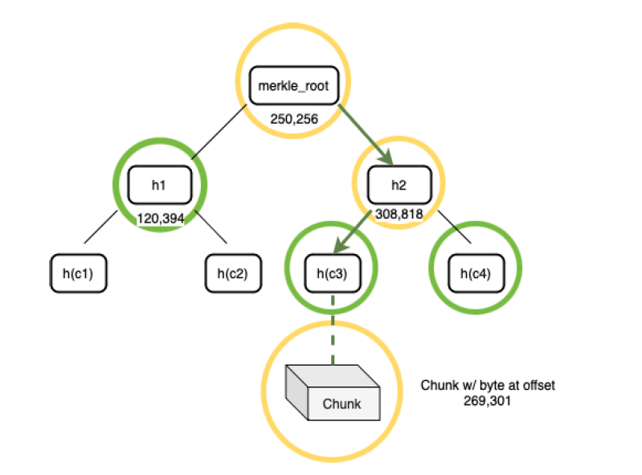

# Arweave

(Information accurate as of 2024/07/11)

Arweave is the last "big boy" major decentralized storage Web3 product on our ~~hitlist~~ research list.

Unlike BTT and Filecoin, Arweave isn't just a decentralized storage solution: it's a _permanent_ storage solution. In their own words, Arweave seeks to address the issues of arbitrary censorship of data and manipulation of "the flow of information" online by allowing for disintermediated (a fancy term for "cutting out the middle man") transfer of information.

Let's take a technical look at Arweave by looking at it's [lightpaper](https://www.arweave.org/files/arweave-lightpaper.pdf) before we discuss the nature of the "permaweb" and "provably neutral web apps".
## Protocol Design

Unlike Filecoin where users have to establish deals with storage providers to ensure the continued existence of their files on the network, Arweave instead calls for a one-time upfront payment to have your data stored on the network _indefinitely_. 

Mining performed by nodes performs two operations in one go: acceptance of new data into the network to be stored on the distributed ledger and the validation of storage of previously uploaded data.

Arweave likes to compare itself to Bitcoin in many ways, but perhaps the most immediate comparison to be made is the proof mechanism: Arweave uses what's called _Proof of Access (PoA)_, which is described as an "enhancement" to good old PoW.
## Blocks

The top-level data structure in Arweave is a Block Index, made up of a block hash, weave size and a transaction root.

The transaction root corresponds to a Merkle tree composed of multiple transactions, which are Merkle trees made up of data roots (described below), which themselves are Merkle trees representing the data to be stored on the network. Although there is a cap of 1000 transactions per block, transactions can behave as a _bundle_, behaving as a pointer to multiple other transactions.

Obviously, we also have regular transactions on the network which do not concern data storage and instead just concern the transfer of $AR from user to user.

Each block embeds the the Merkle root of the previous Block Index so that there's continuity, allowing the most recent block to represent all data stored on the network. 
### Succinct Proofs of Access (SPoA)

Any data that is uploaded to the Arweave network is _merkelized_ by splitting it into regularized 256KiB chunks, then constructing a Merkle tree with these chunks of data. (If you need a refresher on Merkle trees: they're basically a tree of hashes where every branch is the hash of all its children.) With the intrinsic structure of Merkle trees, the root of the merkelized data would therefore behave as an effective hash of the data as a whole, and this _data root_ would be committed into a transaction. 

So when a node holds a copy of some data in its merkelized form, this allows us to play a Proof of Access game: with a requested Merkle root for a Merkle tree corresponding to some data, prove that you are able to access a byte at a given challenge offset.

To be able to accomplish the request, the node would have to step through the Merkle tree to arrive at the corresponding chunk, then pull the chunk itself:

This path traversal will form the Merkle proof and this proof alongside the chunk itself is submitted as the game's solution. This solution can be verified by simply recursing along the submitted path itself and making sure the hashes all match up.
### Packing of Chunks

Arweave uses an algorithm called _RandomX_, which is basically a computationally expensive key generation algorithm. The idea is as follows:

- Instead of simply storing chunks, chunks must be stored in a "packed" form
- Packing, here, refers to the symmetric encryption of a chunk using a key generated with RandomX which incorporates the chunk offset, transaction root and most importantly, the node's mining address
- When data is requested at a chunk offset:
	- If you do not have that chunk, you would have to fetch a packed copy from a peer, unpack it with their key, then pack it with your own key, then produce the proof
	- If you already have the chunk in packed form, you can then produce the proof as required "immediately"

The idea is that the computational cost of unpacking and repacking data outweighs that of simply storing a replica of the data already, incentivizing the continual replication and storage of such replicas such that you're able to produce PoA proofs efficiently and cheaply (one-time packing computation vs repeated computation on demand).
\
RandomX is a CPU bottlenecked algorithm, a choice made by the Arweave devs when they realised people were gaming the system by simply using GPUs to make the unpacking/packing process cheaper than storing replicas of data, defeating the purpose of the network. In this case, the PoW aspect of Arweave is fulfilled with RandomX.
## Succinct Proofs of Replication (SPoRe)

We previously introduced SPoA, which allows us to verify that a node has data pertaining to a relevant chunk of data. Now, we want to make sure that this data is replicated some $n$ number of times across the entire network.

This is accomplished through Succinct Proofs of Replication (SPoRe), which is how the blocks in the network are even created — proofs produced for the SPoRe game make up our blocks.

The SPoRe game can be described as such:
- A hashing algorithm is used which recursively produces $k$ SPoA challenges every second
	- This recursive hashing is called the Verifiable Delay Function (VDF), which a node can either connect to a VDF server that is dedicated to only calculating these challenges or they can compute the VDF themselves
	- These SPoA challenges all correspond to the Merkle root of the current block index. In other words, they will correspond to all data that is supposed to be stored on the network.
	- $k$ is set to $800 \times n_p$, where $n_p$ is the number of 3.6 TiB partitions of all data stored by miners
	- This means that every second, a maximum 800 challenges are issued per partition. For each partition, 400 SPoA challenges will be issued in one range, then the remaining 400 SPoA challenges are issued in another range _dependent_ on the first 400 challenges
		- This is a mechanism that aims to incentivize the storage of all parts of the data rather than just storing only a few continuous ranges as your likelihood of being able to complete the second part of the challenge is dependent on how much of the data is saved
- Miners then fulfill the SPoA challenges, generating hashes for each of their SPoA proofs
- These hashes are compared against a challenge variable $d$, and once a hash passes the challenge, the SPoRe game is won and the block can be appended

Conceptually, if $n$ replicas of the dataset exists on the network, then the SPoRe challenges can be completed every 120 seconds (what Arweave has decided is a reasonable block time) based on the difficulty $d$. 

The overall system of randomized access and proofs of replication is called, well, Succinct Proofs of Random Access (SPoRA), which is the term usually used when discussing Arweave's proof system. The proofs system here are logical to say the least, and efforts have been continually made to prevent gaming of the system (e.g. the rollout of RandomX to circumvent hardware accelerated cheating).

PoW is always going to be computationally "wasteful" by nature. RandomX was built with [some conception of environmental sustainability in mind](https://github.com/ArweaveTeam/arweave-standards/blob/master/ans/ANS-103.md) by the very fact that the computation isn't super intense, just bottlenecked, so the overall footprint of the PoA system is much smaller than PoW.
## Sharing and Accessing of Data

Obviously, to be able to achieve the goal of $n$ replicas of all data, the data must somehow be shared. The Arweave lightpaper discusses a few ways it can be accomplished:

- BitTorrent-esque sharing of data, seeding portions of the dataset to peers
- Literal physical replication and distribution of disks containing significant portions of the network
- The Permaweb Payment Protocol (P3), a service that has you paying to access large sections of data to copy in one go

Practically, it seems like the BitTorrent-esque protocol is natively implemented for Arweave nodes, with their initialization sequence having a syncing step where data is downloaded and unpacked from other network peers.

These aside, unlike Filecoin, you do not need to pay for the unsealing of data. Instead, since all data is actually inscribed onto the blockchain through the above mechanisms, so you can make use of gateways and block explorers ([ViewBlock](https://viewblock.io/arweave) is a simple block explorer for Arweave) that allow you to access the stored data trivially ([example tx](https://viewblock.io/arweave/tx/CzV5wLMsXGtJN6tWalZ31p6Tg3KGmeM52BEOC9LACUg)).

The accessing speed through `arweave.net` is really fast, but this is because data that is inscribed on-chain is being cached by gateways so that you can easily fetch it. A list of Arweave gateways are maintained [here](https://gateway-explorer.vercel.app/#/), and as of time of writing, 199 of all 297 listed are online

In actuality, the process of retrieving data is as cumbersome as you'd expect it to be considering that all data is split into 256KiB chunks:
- You first need to obtain a list of peers from some trusted peer
- You then ask each of those peers if they have the chunk offsets required to reconstruct your file
- If they don't, you then fetch _their_ peer list and iterate through those peers
- Once you get all the chunks needed, you can reconstruct the original file
## Storage Endowment

Miners have to be rewarded for their service, and their $AR payout comes from the network's _storage endowment_, which is composed of all the $AR paid by users to have their data stored on the network.

Obviously, forever is not a real thing, so when you pay for storage, you pay upfront for the storage of 20 replicas for 200 years, where the $AR required to pay is determined through the current network difficulty and an estimate of the cost of the actual data storage. At current rates calculatable on [this site](https://ar-fees.arweave.dev/), as of time of writing it costs ~$18 USD to inscribe a gigabyte of data on Arweave.
## How Much Storage is There on Arweave?

ViewBlock kindly gives us some stats to look at directly. As of 2024/07/13, the total Weave size sits at a reasonable 181.48 TiB, a figure that has been monotonically increasing (as promised) since genesis in 2018. A few hundred Gigs of data gets uploaded daily, which also feels reasonable.
## How Accessible is Arweave?

Unlike the overwhelming inaccessibility of Filecoin, the layman can easily access products built atop Arweave, with [Ardrive](https://ardrive.io/) being the most popular Dropbox-like solution. Ardrive even makes use of the [ArFS](https://cookbook.arweave.dev/concepts/arfs/arfs.html) spec to allow for mutable metadata and filenames for uploaded files by playing around with transaction headers (although the files themselves remain immutable, as promised).

Another popular file storage solution built on top of Arweave is [Akord](https://akord.com/use-arweave) (which has it's own $U token? Interesting).

Arweave also has a webapp to help deploy static sites on the network called [PermaPages](https://permapages.app/), and in the docs for uploading data to Arweave are also really friendly.

Big props to the Arweave team :)
## TL;DR

Arweave is a solution for "permanent" data storage on the blockchain through a unique Proof of Random Access system, a PoW like method of proving the existing of replicas of data and their continued accessibility through a combination of expensive RNG and hashing operations and Merkle proofs. Data inscribed on-chain is readily accessible through Arweave gateways, and there exist convenient data storage solutions built on top of Arweave such as Ardrive.

