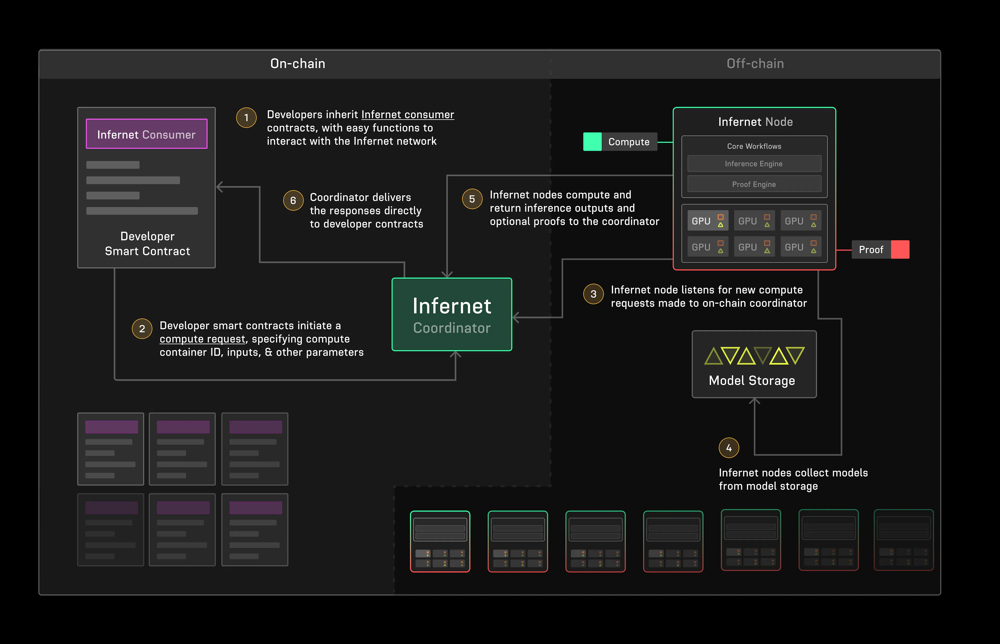

# Yet Another Relay?

What Ritual seeks to enable is not just another decentralized AI inference solution, but a means to bridge off-chain compute on-chain, where inferences that are computed off-chain can be delivered to on-chain smart contracts via their SDK.

What we find here is a combination of many elements found in DeAI/DePIN projects that we've looked at in the past — a cursory glance at the infrastructure may lead one to believe that we're looking at yet another P2P relay type project. 

So, what makes it different or better?

# The Infernet

As it stands, Ritual has yet to launch its own sovereign chain and exists as only a decentralized oracle network "optimized for AI". This oracle network is creatively called the "Infernet", and a high level overview of the infrastructure looks as such:

## Infernet Nodes

- Nodes actively listen for new on-chain tasks or respond to off-chain requests (we'll discuss this a bit more later).
- Infernet Nodes **do not run exclusively AI tasks**. They can actually run arbitrary Docker containers, as long as they adhere to the Infernet Container spec.
	- This is a good feature! This gives the project a good degree of flexibility, compared to... lesser projects.
	- This also means that nodes don't necessarily have to run exclusively GPU intense tasks.
	- As for some technical details that would allow a container to be Infernet-compatible:
		- Server runs on port 3000 internally (Why?)
		- Has a `/service_output` POST request endpoint that adheres to a specific format (detailed in [their docs](https://docs.ritual.net/infernet/node/containers))
		- Output format also adheres to a specific format (Web2 or Web3 dependent)
- Feel free to [deploy node clusters on cloud providers](https://github.com/ritual-net/infernet-deploy) — we're not trying to cosplay complete utter decentralization here.

## Examples of Deployable Services

Judging by the node [container orchestration source code](https://github.com/ritual-net/infernet-node/blob/main/src/orchestration/docker.py), there are systems in place to allow a node to pull a new Docker image to run on an as-and-when is needed basis.

Ritual has does have a set of premade Docker containers that they dub [Infernet Services](https://infernet-services.docs.ritual.net/) (source code available [here](https://github.com/ritual-net/infernet-monorepo/tree/main/infernet_services)), which make use of their own [`infernet-ml`](https://infernet-ml.docs.ritual.net/quickstart/) Python library, a library which basically just implements wrappers around these Infernet Services. (To most end users, the `infernet-ml` library is wholly irrelevant).

These Infernet Services provide us with a view of the sort of off-chain calls to AI models we can perform with Ritual. These include:

- Closed Source Inference: Essentially running a Docker container as a proxy for the OpenAI or PerplexityAI API
	- This is an interesting design choice given the largely samey sounding claims of "wanting to decentralize AI", yet at the same time recognising the utility of being able to write smart contracts that interface with these superior performing centralized models
- [ONNX](https://onnx.ai/) Inference: ONNX is an open standard format for machine learning models (as opposed to distributing pickle files or pytorch models, etc.), so any ONNX model ([examples](https://github.com/onnx/models)) can be run with this Docker container
- [HuggingFace TGI](https://huggingface.co/docs/text-generation-inference/en/index) and the general HuggingFace Inference: As the name implies, any compatible model from HuggingFace can be passed in here
- Torch Inference: Wrapper for PyTorch models.

Similar to other aspects of this project, Ritual leaves things open-ended for devs to load models to their needs rather than imposing the use of certain models that fit their own criteria (such as the case of Crynux, Morpheus, etc.).\
## Completely Off-chain Web2 Requests

- The user is able to completely bypass smart contracts and all that jazz, opting for purely Web2 reequests
- Requests are made directly to an Infernet Node, which will dispatch the job to the appropriate container based on the requested compute
- A unique Job ID is generated 
	- For one time requests, this allows the user to poll for progress on the request and fetch the result once it is completed
	- If a streaming request is made, you can then use this ID to access the output stream

