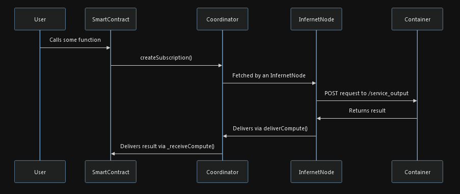
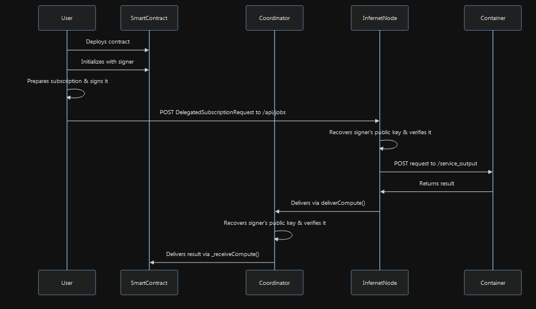

As a note, the overall workflow for task routing that Ritual proposes is, frankly, quite similar to a project we have looked at in the past: [Crynux](https://crynux.ai). The key difference is that Ritual proposes a general framework that can operate as an SDK, rather than a fixed implementation that is built for a specific task.
# The Coordinator

In order to bridge on-chain requests for jobs to nodes operating off-chain, there has to be, well, a bridge.

The Infernet nodes listen to the [Coordinator.sol](https://github.com/ritual-net/infernet-sdk/blob/8e6cd6f5cbd66dc9baacb895a2ed8fe2c9ee3b6f/src/Coordinator.sol) contract, which has been [deployed on Base](https://basescan.org/address/0x8d871ef2826ac9001fb2e33fdd6379b6aabf449c). This contract is how Subscriptions are managed, which are the one-time callback or recurring inference requests that a user makes.

The relaying performed is fairly intuitive:


The parameters involved in the subscription are of note:
- Frequency of subscription: how many times a call is made (poor use of terminology here)
- Period of subscription: how often the subscription is performed 
- Redundancy: how many responses do I want?
	- This allows for a sort of direct implementation of response validation via consensus as you can query for as many additional "identical" responses to the same prompt as you wish, and you can sort of create a penalty system with a verifier contract
- Lazy: enabling asynchronous callbacks, where instead of having a blocking wait for the response from the Infernet nodes, the result would instead be sent to an [Inbox contract](https://github.com/ritual-net/infernet-sdk/blob/8e6cd6f5cbd66dc9baacb895a2ed8fe2c9ee3b6f/src/Inbox.sol#L4), where it can be fetched from later.
- Verifier: an optional verifier contract which follows their [interface spec](https://docs.ritual.net/infernet/sdk/reference/payments/IVerifier), where nodes will not receive the payment for the subscription if it fails the verification
	- This offloads the responsibility of compute verification to the developer, which is a good and bad thing depending on how you see it (we will discuss this further later)
- Payment amount and token: how much you're willing to pay for each processing of the subscription and in what denomination. You can set it to 0 even.
	- Nodes are free to set a minimum payment amount and in what denomination and can thus refuse requests that do not meet this bar
	- Presumably, if your contract is making calls to an off-chain cluster that you own, then you'd want to set this payment amount to 0 so you wouldn't be wasting gas transferring funds internally within your own operation
	- For the above point, nodes are able to whitelist addresses that would be allowed to call them such that their "free" calls are not abused

# Subscription Delegation

As previously mentioned, you can bypass the Coordinator contract altogether by performing a Web2 POST request to a node directly and receiving its inference result, but Ritual also supports performing Web2 requests and then having the result be emitted to the Coordinator smart contract still, then allowing the result from `_receiveComputer()` to pass through to your deployed smart contract on-chain. 



I'm assuming this allows you to save on gas as the number of on-chain operations is reduced since you don't have to interact with your smart contract for the prompting and having it relay to the Coordinator, then the Infernet nodes themselves. This also allows you to perform direct interactions with your nodes of choice rather than relying on those nodes picking up your job from listening to the Coordinator contract.

Essentially, you simply create a subscription object off-chain and sign it with your wallet's keypair, then send this subscription object to the Infernet nodes of choice through the aforementioned POST request. After processing, instead of sending the result directly back to you, it will instead be delivered to the Coordinator contract, then passed on to your on-chain smart contract that would be awaiting the response.

# Verifications/Proof of Compute

As previously mentioned, the responsibility of setting up validation and verification for your inference results falls onto the developer to implement a verification scheme.

Ritual provides the primitives to enable this by creating escrows which holds both the consumer's funds (which would be the verification fee, which comes atop the payment for the compute itself) and the node's funds (which would be some amount of tokens specified by the subscription). 

Essentially, there is a slashing mechanism in place. When a proof is required for the compute, the node will return both the compute result and some proof metric.

- With eager verification, only the proof metric is sent over to the consumer, after which the proof metrics are evaluated, and if the verification passes, the payment is released to the nodes and the compute result is sent to the consumer.
- With lazy verification, the compute result would be sent to the consumer _before_ verification is complete, and the verification fee would be released to the nodes at a later point in time after verification is complete.

What is mildly confusing is how the slashing mechanism is performed. There is some amount of tokens that will be escrowed from the node based on what's specified in the subscription, and if the proof is deemed invalid by the consumer, these tokens will be slashed. However, slashing involves sending the escrowed node tokens to the consumer?

This is the code segment pertaining to this:
```solidity
 If proof is valid
            if (valid) {
                // Process payment to node
                Wallet(sub.wallet).cTransfer(
                    sub.owner, sub.paymentToken, address(request.nodeWallet), request.consumerEscrowed
                );
                // Else, if proof is not valid
            } else {
                // Slash node
                request.nodeWallet.cTransfer(node, sub.paymentToken, sub.wallet, sub.paymentAmount);
            }
```

Very bizarre.

One could consider gaming the system by creating faulty verification contracts that would continuously penalize nodes, but node providers can set whether the Docker containers they are running would be able to generate proofs or not (which by default, is set to false). 

There doesn't seem to be a framework in place to whitelist proofs/verification contracts directly, instead the docs recommend simply whitelisting the consumer contracts which will request for the proof the container is able to cater for. This means you can't generalize and respond to any and all smart contracts that make requests with a certain proof type that you can deliver on, just known smart contracts that you are willing to interact with. (This is a rectifiable shortcoming.)

### Ritual's Stance on Verifiable Compute

Ritual's cofounder, [Akilesh Potti](https://x.com/akileshpotti), has thrown his two cents concerning the need for verifiability when it comes to deAI. Condensing his points: the scene currently has an overemphasis on producing projects oriented around provable compute (e.g. zkML type projects), and at the end of the day proof of compute will turn into costs consumers have to absorb.

As such, Ritual takes a proof system agnostic approach (in other words, making _you_ do the work) as the average consumer probably _doesn't care enough_ and would be happy to receive cheaper inferences without the overhead of compute verification. 

This stance of being able to grant users a choice as to whether they wish to spend more in order to generate compute proofs is one that I do agree with, especially given that many of the more "reliable" systems in place would lead to excess redundant compute (e.g. in a consensus based proof system) or gross amounts of computation needed to subpar results (in the case of cryptographically secure proofs, ZKPs, FHEs, etc.).
# In a Nutshell

What Ritual has provided now with the Infernet is exactly as advertised: a decentralized oracle network with an SDK which behaves as a framework that developers can utilize to integrate off-chain processing of, say, AI related inferences, into their smart contracts.

The safety guards are at a bare minimum because the responsibility of implementing safety guards is offloaded to the developer which wishes to use the network — the building blocks are simply there for you to use, and given how downright _simple_ these building blocks are, there isn't simply isn't enough complexity for things to go awfully awry.

