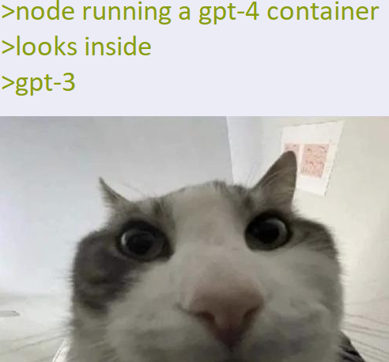

Notes accurate as of 2024/07/04
# Querying the Router

Infernet does provide a [Router](https://docs.ritual.net/infernet/router/introduction) for users to be able to discover nodes that are able to process the compute that you'd request for, which can also give us a look into the current state of affairs:

Querying the production router at http://infernet-router.ritual.net/api/v1/containers, we find that:
- There are 567 nodes running `hello-world` containers, the default container deployed when you set up a  node
- There are 219 nodes running [`infernet-anvil`](https://hub.docker.com/r/ritualnetwork/infernet-anvil) containers, so these are nodes that have a dev environment set up with Anvil that for some reason is also broadcasting that it has it running
- There are 33 nodes running `gpt4` containers, which should all be OpenAI wrappers
- We only have 1 node (each?) running the other sorts of containers, which range from MLX-LLMs to Llama-2 TGIs

Thus realistically, if you want to rely on the existing Infernet for some request without running your own dedicated node to respond to your smart contract, you can probably at most get the 
"decentralized inference" of the 33 odd nodes running... a wrapper for the centralized ChatGPT4.

We can get the IP addresses of all of these containers by making a request to http://infernet-router.ritual.net/api/v1/ips?container=gpt4&n=33.

# Interacting with a Node

Out of convenience (since I don't want to cURL everything and because I do not want to deploy a smart contract to prod), we will be performing off-chain requests to the live nodes using the [`infernet-client`](https://infernet-client.docs.ritual.net/) CLI.

Picking a random node from the IP list we obtain above, we can pull the full node information like this:

```
➜ infernet-client info
{
  "chain": {
    "address": "0x1C822532359c760A49D65642d393948370986e95",
    "enabled": true
  },
  "containers": [
    {
      "description": "",
      "external": true,
      "id": "gpt4",
      "image": "ritualnetwork/example-gpt4-infernet:latest"
    }
  ],
  "pending": {
    "offchain": 0,
    "onchain": 0
  },
  "version": "1.0.0"
}
```

We create a job request as such:

```json
{
	"containers":["gpt4"], 
	"data": {
		"prompt": "I would like python code to perform a search query to google and print the output"
	}
}
```

And requesting for the output from the Job ID we receive:

```
➜  infernet-client results --id 468c3109-2493-405e-8719-235518f7499e
[
  {
    "id": "468c3109-2493-405e-8719-235518f7499e",
    "result": {
      "container": "gpt4",
      "output": {
        "message": "I'm sorry, but automated scraping of Google search results is against Google's terms of service, and it may lead to your IP address being blocked. \n\nIf you are looking to search and retrieve data from Google, I recommend you to use the Google Custom Search API, which allows you to make searches with a valid API key. \n\nHere is an example Python code snippet that demonstrates how you can use the Google Custom Search API:\n\n```python\nimport requests\n\n# Set your Google Custom Search API key and search engine ID\nAPI_KEY = \"your_api_key_here\"\nSEARCH_ENGINE_ID = \"your_search_engine_id_here\"\n\n# Make a search query\nquery = \"Your search query here\"\nurl = f\"https://www.googleapis.com/customsearch/v1?q={query}&key={API_KEY}&cx={SEARCH_ENGINE_ID}\"\n\n# Send the request\nresponse = requests.get(url)\n\n# Check if the request was successful\nif response.status_code == 200:\n    search_results = response.json()\n
 \n    # Print the search results\n    for item in search_results['items']:\n        print(item['title'])\n        print(item['link'])\n        print()\nelse:\n    print(\"Error with the request\")\n```\n\nBefore using the Google Custom Search API, you need to create a Google Custom Search Engine and obtain an API key. You can find more information on how to set up the Google Custom Search API and obtain the necessary credentials in the Google Developer documentation. \n\nPlease be sure to review and comply with Google's terms of service when using their APIs. Let me know if you have any other questions or need further assistance!"
      }
    },
    "status": "success"
  }
]
```

So we can see that the Docker containers these nodes are running are actually functional! On top of that, we've basically got an exposed GPT4 instance free to use... right?

Prompting GPT4 and GPT3.5 directly with our own OpenAI keys with identical prompts gives us very different results, recommending the usage of `googlesearch-python` and not just ditching us like the above response. The response time is also suspiciously fast for GPT4. Hmm...

Well, prompting to query for the model information (which of course can be hallucinated/spoofed, but it's the best we can do):

```
➜ infernet-client results --id aeb55ae8-fb7a-4ffb-886f-b7bdcbedef37
[
  {
    "id": "aeb55ae8-fb7a-4ffb-886f-b7bdcbedef37",
    "result": {
      "container": "gpt4",
      "output": {
        "message": "I am running the GPT-3 model from OpenAI. My system prompt is based on the user's input and context, and I generate responses using the GPT-3 model. How can I assist you today?"
      }
    },
    "status": "success"
  }
]
```



Well, that's more or less what I expected .\_.

