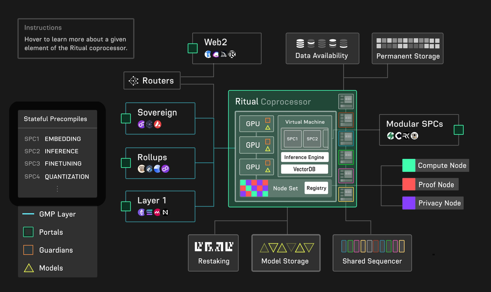

# What's To Come

This is where things get spicy and of course, confusing.

The grand plan for Ritual is the _Ritual Coprocessor_, a sovereign chain which has its own custom VM, and frankly, details are sparse.

Here's what we can gleam from the blogposts that have been published on the matter:
## Portals

On this diagram, Sovereign, Rollups, L1s, Web2 and "Modular SPCs" are all listed as _portals_. This is just another way of saying SDKs and contracts would be created that would allow developers to bridge to Ritual and request for inferences/compute etc.
## Model Storage

In their words, "models are first-class citizens in the Ritual Superchain". Supposedly, models will be hosted on a "permissionless and censorship-resistant storage layer" as opposed to just pulling models from HuggingFace like we've been doing this whole time. Sounds like they're just going to use Arweave or something.
## Permanent Storage

Not to be confused with Model Storage, apparently artifacts and metadata will be stored here. In this case, it may be for "deterministically reconstructing computation of models".
## New Nodes

Besides the Infernet Compute Nodes, there'll be Proof Nodes and Privacy Nodes introduced.
### Sidenote: Ritual and Proofs, Again

In spite of our previous discussion of Ritual's cofounder's stance on proofs, the proposals for the Ritual Superchain seem to seek to heavily integrate native proof systems, although it is unclear whether they would be enforced or continue to remain optional.
## The VM Itself

So the Ritual VM will have "Stateful Precompiles" (SPCs), which seem to just be stages of a deep learning pipeline, an Inference Engine (is this just the Infernet that we've already seen?), VectorDB (for storing embeddings, presumably)... 
## Integration with EigenLayer

Ritual would have its security bootstrapped via EigenLayer, borrowing its staking power. Operators on EigenLayer can register as nodes on Ritual, in which their stake on EigenLayer will behave as a stake on Ritual as well and subject to slashing on failure to deliver on proofs, etc.

There's a vague mention of how restaked EigenLayer nodes can behave as routers, although this is not explained at all.
## Integration with Celestia

Again, vague promises of being able to publish computation proofs to Celestia's DA layer and using the layer for "relevant transaction data around model workflows".

# Concluding Remarks

Trying to do research on this "sovereign chain" was frustrating as it very quickly devolved into a buzzword salad, with very little actual information on how the chain would operate and instead having it integrate all the hot new Web3 tech and placing emphasis on the "importance of verifiable compute".

Reiterating from earlier, the Infernet that they've already deployed is a barebones but functional framework that allows for bridging of off-chain inferences to an on-chain application. As nifty as it is, this isn't groundbreaking — it's just another DON, and we've been talking about DONs since the days of actual $LINK Marine bullposting.

The upcoming sovereign chain is hard to evaluate as is as there is no whitepaper, no roadmap, just a bundle of hopes and possibilities. It'd be interesting to see where the project goes from here and there's value in keeping up with its updates, especially given how much they've proposed and supposedly plan to deliver on.
