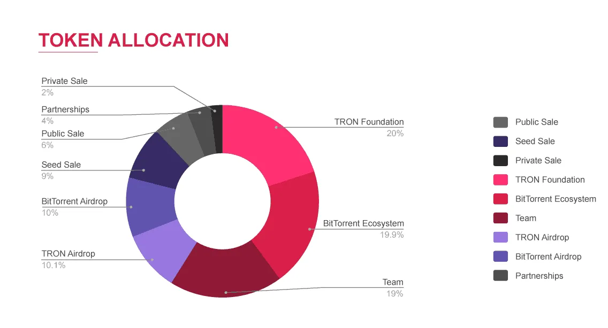

# A Tour of the Land

In the land of Web3 and cryptocurrencies, decentralized storage has long been a narrative thrown about and one of the more "tangible" and (ideally) easily accessible technologies offered by decentralized systems. 

When everyone was obsessed with NFTs (those without utility beyond being a pointer to an image), [almost half of all those "artworks" were being hosted on IPFS](https://www.rightclicksave.com/article/how-many-nfts-are-actually-on-the-blockchain) (InterPlanetary File System). Even now with the current memecoin craze, your Solana shitcoin token icons are being uploaded to IPFS (pump.fun uses Pinata, an IPFS pinning service, to host token icons via https://pump.mypinata.cloud/ipfs/).

Besides the "free" option of participating in IPFS on its own, we can introduce monetary incentives to participate in the construction of decentralized storage solutions, giving birth to the earliest form of dePIN.

As it stands, decentralized storage solutions with crypto tokens are dominated by the following projects:

- Arweave
- Filecoin
- BitTorrent Token 

I believe there's value in understanding each of these projects on their own and the differences between them as it'll provide us with a good basis to compare newer projects to.

# The Bottom Line: BitTorrent

Torrenting is possibly the most widespread and popular form of P2P file-sharing and can easily be considered a _form_ of decentralized data storage as its a necessity to facilitate, well, the distribution of files that people wish to torrent. It used to make up [a literal third of all internet traffic](https://torrentfreak.com/bittorrent-the-one-third-of-all-internet-traffic-myth/), but has since shrunken to about [4% of all bandwidth on the internet](https://torrentfreak.com/bittorrent-is-no-longer-the-king-of-upstream-internet-traffic-240315/). That's still massive, of course.

## The Absolute Basics of Torrenting

For the uninitiated, BitTorrent functions through a system of _peers_ and _seeders_.

When you first upload a file, you _seed_ it, in which _peers_ will form a direct connection (!) to your system (IP exposed and all, of course) and download a copy of the file you upload. Once they've downloaded the file, they too can turn from _peers_ to _seeders_, and now future peers that come along can download fragments, called _pieces_, of that file from multiple seeders in a non-sequential manner

This enables users to perform partial downloads of large files from the distributed network as they simply fetch pieces from multiple seeders, limited by their own bandwidth and the bandwidth of the seeders. To ensure file integrity, cryptographic hashes of each piece is made at the beginning, and this metadata is shared to peers that later turn into seeders.

## Leeches and Altruism

Perhaps the most immediate issue that one can recognise with torrenting is that of _leeches_, peers which download files but do not in turn seed them — they leverage the goodwill of seeders who host their own copies of the file but do not contribute to the continued distribution of the file.

It's often considered the bare minimum to uphold a seed ratio of 1:1 — for every file you download, you seed pieces equivalent to at least one whole download. After all, if seeders decide to stop seeding a file, then the torrent can just straight up die as there are no longer any providers to download from. 

And this brings us to the key principles that torrenting (and often, piracy through torrenting) is built atop: good will, sharing, and a common good.

_Realistically, there is no hard incentive to seed a file_. But people will be needing that ISO download of some Linux distribution or some crack of an Adobe product, and it's just nice to share. Sharing is caring, after all. But obviously, this hinges on the torrents you're seeding being popular enough, _needed_ enough to warrant continued distribution (in the case of public, mainstream torrents). 

Outside of private trackers (where those torrenting compose a community and often would be seeding more "hard-to-get" files which you'd want to continue being able to access by responsibly contributing to the community through hosting your own files and upholding a good seed ratio), if you just upload some random file, you'll probably find that nobody has any good reason to download and seed your file too. 

This is why we usually consider BitTorrent simply a decentralized file sharing protocol rather than a decentralized storage solution — not every file would be arbitrarily shared and experience temporary decentralized permanence (a fun oxymoronic statement).

# $BTT: A Spectacular Failure

Justin Sun, founder of Tron, sued by many, also happened to buy BitTorrent Inc in 2018, after which the utility token $BTT was launched with one of the most inane token allocations one could envision:

Bar the hilarity of the token allocation, $BTT has a simple principle behind it: introducing monetary incentives to torrenting.

By paying in $BTT, you can provide tokens to uploaders such that you receive faster download speeds as they'll carve out greater bandwidth for you. For seeders, by receiving $BTT, they are incentivised to continue seeding. Simple, and *very much against the ethos of torrenting!*

Besides gains from speculation, $BTT has [not produced tangible benefits for torrenters](https://www.reddit.com/r/Tronix/comments/mfw7cz/has_anyone_gained_btt_from_bittorrent_speed_and/) , be it monetary or the barely faster download speeds. And at the end of the day, this is to be expected: for the productive work that $BTT is supposed to match, one would expect it's price to eventually form a parity with it; in other words, $BTT, without speculative elements, would at most cover the actual cost of bandwidth plus a miniscule reward. 

Furthermore, your $BTT yield is determined by how much you're seeding. Calling back to the nature of torrenting, the most popular files that would be seeded are likely illegal pirated content, so to seed in high amounts to actually earn appreciable $BTT puts you at risk of getting fined, screwed by your ISP or [straight up arrested](https://en.wikipedia.org/wiki/Legal_issues_with_BitTorrent). Hiding behind a VPN would decimate your $BTT yield as it drastically cuts your bandwidth, so all in all, _the actual seeders simply aren't gaining anything from $BTT_.
## BTFS and the BTTC Mainnet

BTFS or the "BitTorrent FileSystem" was made in response to the earlier point of people not going to seed your random files: what if they just _did_? BTFS, at its core, is a carbon copy of the IPFS-$FIL system (we'll look at that right after this), and it was a _complete and utter failure._

[Nobody uses it](https://www.reddit.com/r/BittorrentToken/comments/q5swax/btfs_experience_after_20_days/) and the project is, for all intents and purposes, basically dead. [No roadmap updates since 2021](https://www.bittorrent.com/token/bittorrent-file-system) and [no appreciable updates since 2022](https://github.com/bittorrent/go-btfs/commits/master/), with a BitTorrent "chain" on TRON... why?

I've ragged on $BTT quite a lot here, but I believe it's the quintessential case study of just how crypto can often behave as an unnecessary addition to an otherwise perfectly fine model and how this shoehorning can easily collapse. 

$BTT was and continues to purely be a speculative asset that in no way mirrors the actual product that it's supposed to be for, nor does it truly reflect the torrenting community at large, which honestly makes it no better than a shitcoin trying to ride off the "nostalgia" of being an early 2000s pirate. [Callbacks to everyone's favourite blogpost of the year](https://polynya.mirror.xyz/OXfL6yiNu7wxiLlcoKX3d6EIsVoiB1a7k9MkDIthBAA).

# IPFS

IPFS is by far the most widely used "decentralized storage" solution there is, being used (provably and successfully!) to host censorship resistant media, pirated textbooks, Wikipedia archives, etc.

Boasting over 280k unique nodes "pinning" over a billion files, IPFS is *not* a blockchain project! It's simply a pure P2P decentralized storage solution. 

IPFS, in essence, mirrors torrenting in the sense that multiple nodes host copies of the same file, and files are retrieved by downloading fragments from those nodes. _Pinning_ here is their equivalent operation to _seeding_.

However, IPFS has some key differences:
- Files are chunked similarly to the piece system in BitTorrent, but these chunks build up a Merkle DAG
- This Merkle DAG is used for verification purposes and also for distribution purposes — when files are retrieved from providers, they follow this Merkle DAG
- Files are content-addressable with a Content Identifier (CID) in a cleaner manner compared to torrent magnet links

At the same time, IPFS faces the exact same issue: persistence is dependent on how many nodes are helping to pin your file, so if you cease to pin your file and there are no other nodes pinning it, the file is lost to the aether!
## Caches and Pining Services

## Snide Remarks on Gateways

# Filecoin

(Information accurate as of 2024/07/10)

Filecoin is a token that flew to an ATH of $237.24 at the peak of the 2021 bull run and now sits about 98.37% down from that ATH at $3.90. This hype was mostly driven in tandem with the NFT bubble of the time as Filecoin was OpenSea's solution to NFT metadata and content storage, facilitated via their product [NFT.storage](https://nft.storage/).

If you want to simplify Filecoin's function into a one-liner: monetary incentives to promote file persistence on IPFS.

# Arweave

(Information accurate as of 2024/07/10)