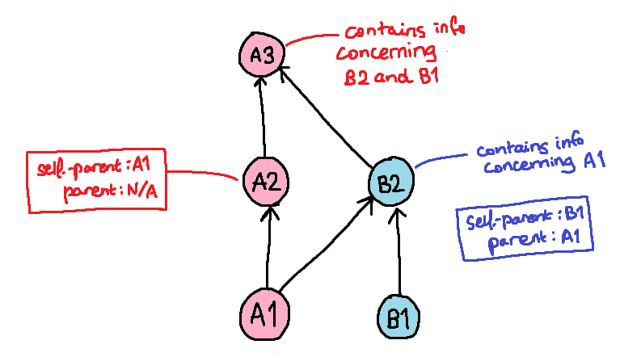
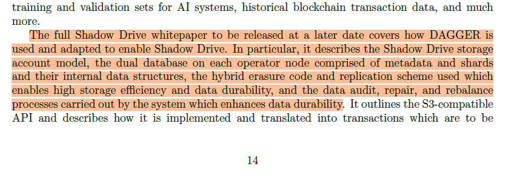

# Shadow

## Value Proposition

Shadow sits between other decentralized/distributed storage solutions by trying to be sort of the "everything" storage project, being able to function as a high speed CDN, an archival system, personal storage solution, etc. Basically, a bundle of IPFS, $FIL and $AR altogether!

From what we can gleam from their docs and blogs, Shadow aims to be:
- User friendly SDK that can be integrated into projects easily
- "Reliable" storage that scales through "robust CDN design"
- Ability to choose between mutable and immutable data storage
- Able to function as:
	- a CDN with S3 compatibility
	- a data archive with "x3 replication, secure erasure and encryption"
	- a personal Dropbox like drive

Shadow also claims that it's base implementation, named *DAGGER*, can also be extended to operate as an oracle/orchestration protocol to enable it to function as a compute provider (in the DigitalOcean Droplets/Amazon EC2 instances sense, so closer to Akash, further from AO). Lots of big claims being thrown around!

As it stands, Shadow is currently on its second phase of its Testnet (which introduces incentives in the form of $SHDW tokens) which implements this DAGGER framework (which we dub as shdwDrive v2) while having a live implementation (being shdwDrive v1).

## Addressing shdwDrive v1

The current live production version of Shadow that people are free to interact with is said to be built atop [Ceph](https://en.wikipedia.org/wiki/Ceph_(software)), which is an existing distributed file storage solution that has found usage in services such as DigitalOcean and projects like [literally CERN](https://cephdocs.s3-website.cern.ch/ops/clusters/index.html). We're not here to enable stolen valor however — Ceph is a brilliant piece of technology used by many, but _this is something that the Shadow developers simply forked and modified_.

Furthermore, from my understanding, shdwDrive v1 relies entirely on interactions with their API hosted on https://shdw-drive.genesysgo.net/. Yes, there exists Solana contracts to do with the project at present, but it for sure isn't some _Solana based implementation of Ceph_.

There isn't a way to become a node operator to participate in their Ceph cluster, so what we're dealing with very much is just an API endpoint to a centralised cluster hosted by the Shadow team that happens to have interactions with it reflected on Solana, which makes it no different from just uploading files to Google Drive or something (except if they are running a Ceph cluster as advertised, then your files are sort of doubly safe. Also, besides a 1Gb filesize limit, uploaded files wouldn't be prone to content restrictions, which aligns with the whole ethos of censorship resistance etc.).
### The Solana Parts

So let's actually dig into what has been implemented for shdwDrive v1 that has to do with Solana and the $SHDW token.

Fortunately, the [Typescript SDK](https://github.com/GenesysGo/shadow-drive/tree/main) gives us a view into the various contract interactions that can be performed and thankfully an [IDL (Interface Definition Language)](https://github.com/GenesysGo/shadow-drive/blob/a9ad4f0b883a242194c86d1d8ab8321ab57a5726/src/utils/idl.ts#L1) for the main ShadowDrive contract is available. There's no contract source, but with the IDL we can infer all the operations it would conduct.

Looking through the SDK reveals that there's like... not much to it?

You first [create a Storage Account](https://github.com/GenesysGo/shadow-drive/blob/main/src/methods/create-storage-account.ts) and a Staking Account, where your Storage Account is supposed to be a parent to a bunch of child File Accounts (although this doesn't seem to be implemented in practice?) and your Staking Account is what holds your storage fees/stake (explicitly stated in the [StorageConfig](https://github.com/GenesysGo/shadow-drive/blob/a9ad4f0b883a242194c86d1d8ab8321ab57a5726/src/types/accounts/StorageConfig.ts) spec). 

The uploading of your files will be facilitated through the aforementioned API, and your Storage Account simply serves as an identifier for the files, with "verification" being handled by a signed message using your wallet's private key. Funds are then added to the Staking Account in the form of $SHDW tokens, which appear to be burnt over time. In other words, we simply have a model for paying for storage space on their centralized cluster with an SPL token.

This is somewhat disappointing? But let's give the team the benefit of the doubt: what they're doing here is shipping an MVP (that, granted, doesn't implement their novel DAGGER algorithm yet) that devs can use for the time being rather than working with an unstable testnet (especially when they're already using a live SPL token).

## D.A.G.G.E.R.

_DAGGER_, short for "Directed Acyclic Gossip Graph Enabling Replication", is meant to be a scalable system meant for "reaching consensus via an asynchronous graph-based Byzantine fault tolerant mechanism". 

For those unfamiliar with graph theory, a Directed Acyclic Graph (DAG) is a graph structure where the vertices of the graph are connected to each other with, well, directed connections (A -> B =/= B -> A), and if you trace these connections, you will never find yourself in a loop of vertices (thus, acyclic).

### Events

Nodes/operators maintain a local DAG which represents a partial view of the overall network, with the graph being composed of _Events_, essentially a signed, timestamped block of Merkelized transactions + the hashes of its parents. Each event has a *parent* and a *self-parent*:
- Self-parents: if an operator adds a new event to the DAG themselves (in other words, the event is made up of transactions that _this operator received_), the self-parent to this event is the last event in the DAG also created by this operator. _All events (besides the genesis block) must have a self-parent_.
- Parents: when an operator syncs with a peer, it will receive new events from that peer. The operator that receives these new events will then create and add an event of their own made up of the contents they just received. We call this process of synchronization _gossiping_. To reflect an acknowledgement of gossip, this new event will then have a _parent_, which is the **latest event of the peer's DAG**.

The terminology concerning events is a little confusing, so here are some diagrams to help:

In this example, we have two node operators A and B, which have a genesis event A1 and B1 respectively. We shall list the events in the order that they are created:

- B2 is an event created after receiving gossip from operator A, so it contains transaction info from event A1, with a self-parent of B1 and a parent of A1
- A2 is an event created by operator A made up of transactions it has received (**not transactions received from another peer as gossip**), with a self-parent of A1 but no parent.
- A3 is then an event created after receiving gossip from operator B. As this is the first time A has received events from B, so A3 contains transaction info from events B2 and B1. It then has a self-parent of B2 and a parent of A2.

Thus, any event that has a parent also denotes that a sync has occurred between two peers. These events, when created, will then contain the signature of the event's parent and self-parent (if applicable).

### Consensus

There has to be a consensus on the ordering of events before a transaction can be finalized. To simplify the process, we essentially require that an event exists in 2/3 of all operator's graphs when you traverse backwards through it. If events are to be in conflict, a voting algorithm is employed to determine which should come first in the DAG.

Thus, in contrast to a PoW or PoS blockchain network, consensus is achieved through graph traversal and analysis across all operators, with an attacker requiring to perform a sort of 67% attack in order to foil this asynchronous consensus. 

The asynchrony of the consensus algorithm is one of the main selling points of using a DAG rather than a traditional blockchain — block times are essentially eliminated, which means that transactions can be processed basically whenever. Furthermore, every event essentially acts as a "vote" on prior events (by the nature of how a DAG is constructed), so consensus is achieved here without requiring some costly computational operation such as a PoW.

## The Storage Part

We've established (at least at a high level) how transactions are chained together here in Shadow's DAGGER system, but we've yet to discuss how this actually works out for the use of Shadow as a storage solution.

And I'd love to get into it, but...

I've been digging lots and I still can't find any leads to how exactly the storage solution is built atop DAGGER. I can't even really speculate on how, say, data replication would be accomplished? Is it just by making use of the graph replication property required to uphold consensus on a DAG?

I also can't seem to get anything working on the Testnet demo available on the Shadow website ([here](https://dagger-hammer.shdwdrive.com/)), neither the "typing game" nor any file uploads. Yikes.

## Are DAGs A Viable Blockchain Alternative?

So that we don't feel completely cheated, I think there's still at least some value in discussing the possible benefits and disadvantages to DAGs.

What Genesys/Shadow has proposed here is very similar to other DAG based projects that we've seen before (you can only build off the DAG idea in so many ways), offering many of the same benefits that DAGs provide in general.

### No Block Rewards == Cheap TXs

Notice how in the above discussion, there was no concept of a block reward for node operators. Since we've discussed how transactions essentially behave as "proofs" of transactions that come before and after it, then are later finalized when a 2/3 majority is reached, there is no "mining" (unless you want to argue that the construction and replication of the overall network graph is some form of mining) and therefore no mining rewards. By extension, gas fees are dirt cheap.
### TX Speed  

Since we do not necessarily require $n$ transactions to be bundled together in a block before it can be added to the global ledger and then certified by participating nodes, there isn't an idea of a "block time". TXs can therefore be validated and executed faster as long as gossip gets around quickly for all nodes to add the TX to the chain.

### Is It Really Scalable? 

Part of the major selling points of DAGs are "horizontal scalability" as there is a higher TX throughput. However, one has to question whether with an increase in node operators whether the gossiping method of propagating TXs across the network will be able to scale effectively. Furthermore, you sort of need there to be a high TX volume for the DAG to operate as intended given that consensus is only achievable once TXs are spread throughout the history of the operators and "signed off" by future TXs. 

Also, maintaining the whole DAG isn't cheap: although a DAG doesn't look like a blockchain, at the end of the day, it still has to maintain an ordered list of all transactions performed on the network. And in order to prevent, say, double spending, operators still have to maintain a whole copy of the transaction history of the network, so you probably need to employ some sort of pruning or sharding, which may then compromise the overall security of the network anyways (since you technically are violating the whole principle of maintaining a global history).

We also just haven't seen whether it can actually scale in practice? There are projects that have employed DAGs (the most popular being IOTA) that basically still rely on centralized operations for "bootstrapping" to prevent double spending etc. as there simply aren't enough nodes operating nor TPS to actually achieve a stable state. DAGGER says it would use a SWIRLDS (the algo used by Hedera) like algorithm in order to perform its voting mechanism to counteract malicious or erroneous transactions, but it hardly elaborates on it.

## Concluding Remarks

Shadow, in its current state, is sort of vaporwave. The current live version of Shadow that devs are able to interface and work with is very much a centralized solution, and as it stands, it is excruciatingly difficult to gauge whether DAGGER would work as intended nor do we have a comprehensive understanding of how the storage part of DAGGER could even be achieved. 

Maybe we just have to give it more time, but as it stands, this isn't the Solana $FIL killer that we've been promised.
