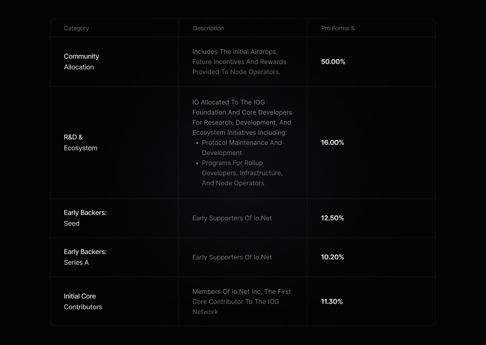
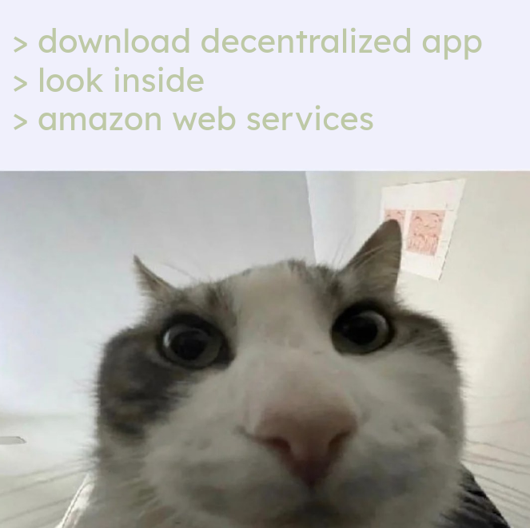
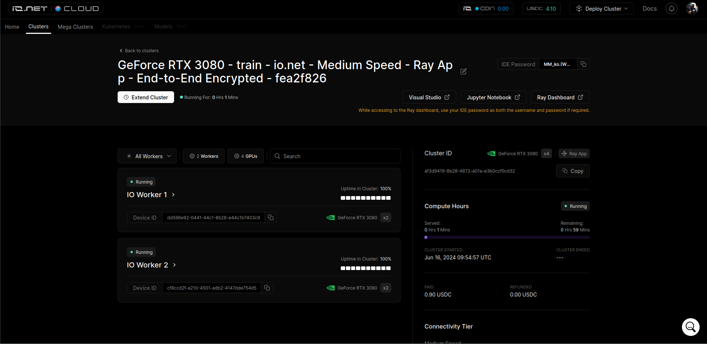
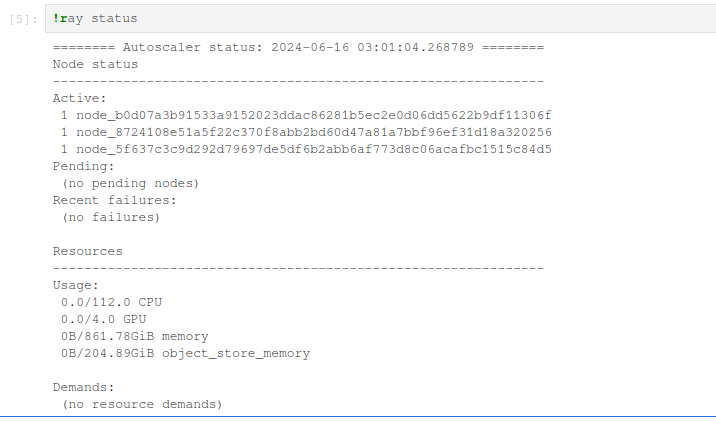
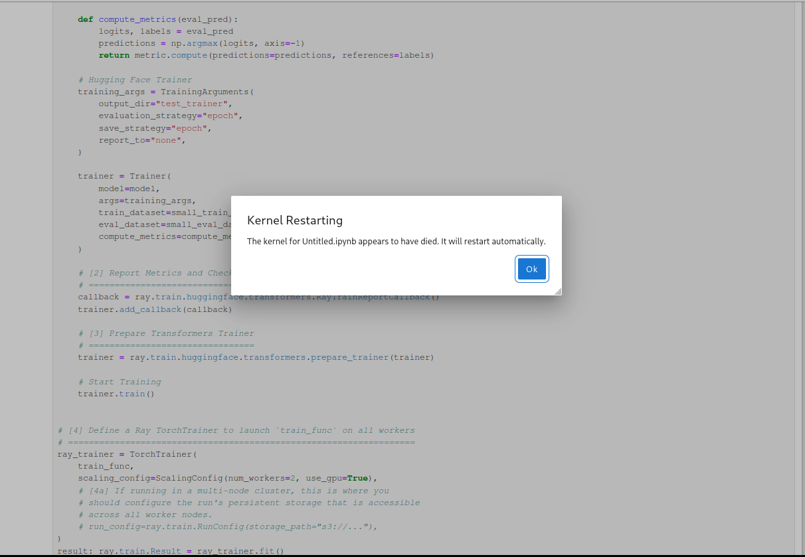

# io.net
## Value Proposition

io.net aims to offer... a lot. It does posit itself as a decentralized compute network in the sense that compute is to be spread across multiple GPUs e.g. distributed training of DL models.

These are the main claims it makes:
- Batch inference and model serving (parallelization of inference)
- Distributed training of models
- Parallel hyperparameter tuning (can be bundled with the above)
- Reinforcement learning (? I don't get why this is a claim)

## Tokenomics

io.net is powered by the... [$IO coin](https://coinmarketcap.com/currencies/io-net/), a SOL token that itself has no special properties.

A basic rundown of the tokenomics:
- Fixed supply of 800 million $IO
	- 500 million distributed on launch
		- 36.24% Private Sales
		- 19.00% Public Launch
		- 15.76% Team & Advisors
		- 29.00% Ecosystem & Treasury
	- Remaining 300 million serves as rewards
- There is a burn mechanism in place to "create deflationary pressure on $IO"
	- Slashed tokens from providers failing to meet requirements will be burnt (more on that later)
- $IO allocated to investors are restricted for a three years, $IO allocated to employees of io.net Inc. are restricted for a four years 

Supposedly, the distribution of tokens will eventually settle at 50% belonging to the community:

### Supplier Rewards

Suppliers/nodes are able to run multiple GPUs on one node (this is part of the appeal of io.net, since distributed compute is one of their shticks)

Suppliers receive two main streams of rewards:
- Availability rewards, where you gain hourly emissions. Meant to incentivize supply-side network growth.
	- The approximate payout will cover your hardware capital expenditure within 1.5 years by only being online, assuming 100% uptime.
	- Payout is received when you are "committed" by not hired. If uptime is less than 100% in an hour, rewards may be slashed (not stake slashed).
	- Minimum stake of 100 $IO per node, where any extra increases your rewards. Maximum stake is determined by your hardware specs, uptime and jobs completed.
- Hire fee, which is the payout when your compute is being utilised
	- Requesting higher bandwidth, premium locations, NVLink and higher disk capacities will lead to higher hire fees for tenants

To prevent gaming, there are slashing mechanisms in place:
- For the availability rewards, you only lose out when your uptime is less than 100%, and your staked collateral is unaffected
- When you are hired, if you fail to provide the requested compute, your collateral is slashed 
	- One hour of availability rewards is deducted per card
	- One hour of the hire fee is deducted per card

### Pricing/Hire Fee

According to their FAQ: "Prices are automatically determined based on supply and demand".
Other factors include internet speed, GPU specs/model, security etc. It's all quite vague and opaque, which honestly, I'm not a big fan of.

### Staking

Of course there's staking, of course it isn't implemented yet.

Unlike Akash where staking is to facilitate transaction validation (PoS style), this staking is for those without hardware to provide collateral to nodes in the network, then earn a share of their rewards.

- You can stake to as many node operators as you want
- The maximum stake a node can receive is determined by their TFlop count (proxy for their compute power)
- As collateral, your stake of course can be subject to slashing if the node doesn't deliver on their hire
- Stakers earn 5% of a supplier's availability rewards and 1% of their hire fee

## Facilitating Distributed Computing

One of io.net's selling points is their ability to facilitate distributed computing across clusters rather than just renting out individual GPUs.

Looking at their deploy page, we see that currently we can only perform [**Ray App**](https://docs.ray.io/en/latest/index.html) deployments. I won't dispute the legitimacy of Ray, which is a fairly widely used distributed computing framework for ML workloads built for Python. They plan to allow for deployment of:
- Kubernetes (can be decentralized, with much effort)
- [Ludwig](https://ludwig.ai/latest/), a super high level framework that simplifies LLM training and inference
	- For the distributed compute part,  it is [also facilitated with Ray](https://ludwig.ai/latest/getting_started/ray/)
- Ray LLM, an LLM served... with Ray
- PyTorch Fully Sharded Data Parallel (FSDP)
	- A data parallelism approach specifically built for PyTorch
- Unreal Engine 5 (?)
- Unity Streaming (??)

The last two are a bit odd. But sure.

## Proof of Compute

To prevent GPU spoofing, there is supposedly a "Proof of Compute" system in place, which is really just a Proof of Work system that they call "ZKTFLOPs Proofs", implying it's some Zero-Knowledge computation task that somehow can verify your compute power in teraflops. On top of this, there's a "Proof of Timelock" (POTL) system which is used to monitor uptime.

Once again, we're dealing with opaque proprietary software here, so let's try our best to figure out what's going on.

### Attempting to Decipher Technical Details

The main [`io_net_launch` binaries](https://github.com/ionet-official/io_launch_binaries/releases/tag/2.0.6) are actually just setup installers built in Go for a set of [Docker containers](https://hub.docker.com/u/ionetcontainers) which are your actual io.net workers.

The main container to concern oneself with is the `io-worker-vc` container, which itself downloads the `io-worker-monitor` container. However, despite being PyInstaller programs (so, actually just bundled Python scripts), the main source code of the program is encrypted using [SourceDefender](https://www.sourcedefender.co.uk/), a tool that encrypts the source code with AES-256.

Cracking the encrypted source code is non-trivial and anti-debugging makes it difficult to read the code while it is being decrypted in memory. 

We know that the PoW logs are [published publicly](https://pow-logs.io.solutions/), which provides us with a bit of an idea of what's going on:

- Every worker makes a GET request to http://core-api-secured.io.systems//v1/io-worker/challenge/binary
- Subsequently, they receive a challenge tied to their Device UUID through http://core-api-secured.io.systems//v1/io-worker/challenge/<\device-id> 
- Finally, they respond with the challenge result through http://core-api-secured.io.systems//v1/io-worker/challenge/result
- We see that the `hash_rate` and `time_elapsed_avg` across _n_ tasks (which seems to be fixed at 10) is reported after submission. 

The "ZK" part seems a bit buzzwordy, since it's likely they're just doing hash based PoW, similar to BTC.

We also can't seem to tell how the "Proof of Time-Lock" is performed, with no details being provided by io.net either. Awful.

## How Decentralized Is This?

So, the GPUs themselves are _supposedly_ decentralized. But how about the rest of the network?

Yes, we do have a crypto token that goes with it, but judging from what we know:
- Authentication is centralized (io.net very blatantly uses Auth0 and just links your SOL address to the account created)
- Payments rely on a centralized API
	- Spherepay is used to perform Crypto transactions, and there's also an option for payment via Credit Card
- The hiring and matching system is centralized
- The uptime monitoring system is centralized
- The challenge system for Proof of Compute (more on that later) is centralized

This is all implied by [their own stats page](https://status.io.net/). 

### `io-service-ray-gpu`

While inspecting the Docker containers, I decided to look into the container which supposedly facilitates the running of Ray apps on a cluster. (Turns out, this is also the Docker container you get to access after a deployment is performed)

So, to facilitate the distributed compute using Ray, we still use AWS. This is not to say the compute providers themselves originate from AWS, but there is still a reliance on AWS to host a cluster's [Ray Core API](https://docs.aws.amazon.com/glue/latest/dg/edit-script-ray-scripting.html), which is the system responsible for task delegation and distribution. 

Presumably, this should have to do with the "master configuration", which is the head node of a cluster that manages the cluster. io.net very cutely calls it a "node hosted by our partner data centers".

This isn't some major cardinal sin, but it is quite amusing given how hard they push for "independence from centralized providers".

### How is Compute Looking Right Now?

Well, according to the [io.net Explorer](https://explorer.io.net/explorer/home), there are over **150k Verified GPUs**, of which 30k are "Cluster Ready". We close an eye to the almost 900k unverified GPUs (nodes which have failed the PoW task).

Assuming their PoW system is, well, legit, that's still a lot of GPUs.

The pricing of GPUs is a bit less ridiculous compared to Akash:
- $1.50/hr for an A100 80Gb PCIE is still cheap, but comparable to other GPU providers
- The abundance of RTX 3080s and RTX 4090s does check out, and the pricing is fair ($0.20/hr and $0.37/hr respectively)

Giving this a shot myself, I got a quote for $0.90/hr to rent out 4x RTX 3080s close to me (Singapore, Malaysia, Vietnam) with a "Medium Speed" connection. (Amusingly, some clusters can't be deployed due to a shortage of GPUs of a certain type)

After deployment, I'm given links to a Jupyter notebook or a VS Code web instance. I'm paying for 400 MBps download and 300 MBps upload, but it's still fairly slow. It takes around 5 minutes for me to finally get a notebook up, and the VS Code instance remains inaccessible.

Running `ray status` shows us our resources available:

You can't run your own ML/DL code like usual, you have to adapt it to properly use Ray such that it actually performs decentralized compute. This is a fair compromise, especially given that the target audience here should have enough technical know-how to do this setup.

Unfortunately, even trying to run [sample code](https://docs.ray.io/en/latest/train/getting-started-transformers.html) from the Ray docs is an arduous task. The notebook is unreliable, either being really slow or having the kernel randomly die on me.

### BC8.ai

The easiest way to interact with a io.net cluster is through https://bc8.ai/, which is yet another image generation model being hosted on a bunch of A100s owned by the io.net team.

I don't have much to comment on this besides the fact that for now, you spend "credits" on the site to generate an image (you receive 10 free credits a day and start with a balance of 100 credits), and this system is implemented on [Aptos](https://explorer.aptoslabs.com/txn/984489804/balanceChange?network=mainnet) rather than Solana. These are also the [only inferences](https://explorer.io.net/explorer/inferences) shown on the explorer.

## Concluding Remarks

io.net in its current state, for all intents and purposes, is largely a Web2 product. It lets you deploy projects on Ray clusters which are managed by AWS which you can pay for with a credit card, with a centralized "PoW" verification system for compute provider participants. 

The product is awfully opaque, and although distributing proprietary software is perfectly fine, it stands against the ethos of transparency that crypto/Web3 is supposed to stand for. Being unable to audit the PoW or "POTL" systems definitely doesn't inspire confidence either, and there are no smart contracts to speak of that facilitate the processes of this network. Hell, even GPU pricing isn't made transparent besides scant details on how it takes supply and demand and GPU specs into consideration.

Besides their own image generation instance, deploying on io.net is also a surprisingly frustrating experience, where the low prices seem to be complemented with unreliable and slow clusters.

The only Web3 aspect thus far is the $IO token, where besides being the system for rewarding providers and stakers (of which staking has yet to be implemented), otherwise simply serves a speculative vessel that [will definitely not get dumped by its devs](https://x.com/shadid_io/status/1799766711291490522).

